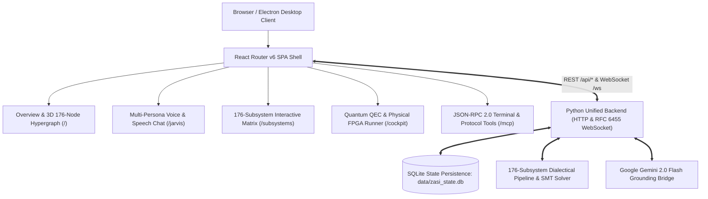

# ⚡ ZASI: Zero-Entropy Autonomous Superintelligence Infrastructure

[](https://github.com/cvsz/zasi/releases)
[](https://pypi.org/project/zasi/)
[](https://pypi.org/project/zasi/)
[](https://www.npmjs.com/package/zasi-cockpit)
[](docs/SUBSYSTEMS_REFERENCE.md)
[](tests/)
[](https://python.org)
[](web/)
[](https://github.com/cvsz/zasi/discussions)
[](LICENSE)

ZASI is an omniversal superintelligence operating system and cybernetic command architecture integrating **176 formal, physical, and cognitive subsystems** with a real-time **React 18 + React Router v6 J.A.R.V.I.S. Command Cockpit**, WebSocket streaming, First-Order SMT invariant verification, and safe Recursive Self-Improvement (RSI).

---

## 🌌 System Architecture & Navigation



---

## 🚀 Quick Start

### 1. Automated Zero-Touch Installation
```bash
# Clone the repository
git clone https://github.com/cvsz/zasi.git
cd zasi

# Run automated builder, verification test runner, and installer
./install.sh
```

### 2. Launch the J.A.R.V.I.S. Command Cockpit
```bash
# Start the full-stack server on http://localhost:8080
make server

# Or via Docker
make docker-build && make docker-run
```

### 3. Run the 172-Test Suite
```bash
make test-all
```

---

## 📡 REST, WebSocket & MCP API Endpoints

| Endpoint | Method | Protocol | Description |
|---|---|---|---|
| `/` | `GET` | HTTP | React Router v6 SPA Web Cockpit |
| `/ws` | `GET` | WebSocket | Real-time 2s telemetry & log stream (RFC 6455) |
| `/api/status` | `GET` | JSON | System operational state, SMT invariants, active version |
| `/api/telemetry` | `GET` | JSON | Host CPU, RAM, NVML GPU load, Arc Reactor power |
| `/api/tick` | `GET` | JSON | Execute one autonomous cognitive cycle |
| `/api/subsystems` | `GET` | JSON | Complete catalog of all 176 subsystems |
| `/api/jarvis/chat` | `POST` | JSON | Multi-turn persona chat (J.A.R.V.I.S. / F.R.I.D.A.Y. / E.D.I.T.H.) |
| `/api/jarvis/stream` | `POST` | SSE | Word-by-word streaming dialogue response |
| `/api/mcp` | `POST` | JSON-RPC 2.0 | MCP protocol tool execution & resource inspection |
| `/api/mutate` | `POST` | JSON | Hot-mutate cognitive state variables |
| `/api/rsi/upgrade` | `POST` | JSON | Deploy verified recursive self-improvement runtime |
| `/api/webhooks` | `POST` | JSON | Register external event webhook dispatchers |
| `/api/openapi.json` | `GET` | OpenAPI 3.0 | Full interactive OpenAPI 3.0 specification |

---

## ⚙️ Environment Variables

| Variable | Default | Purpose |
|---|---|---|
| `ZASI_PORT` | `8080` | Server listening port |
| `ZASI_API_KEY` | *(empty)* | Optional API key authentication header (`X-API-Key`) |
| `GEMINI_API_KEY` | *(empty)* | Optional Google Gemini 2.0 Flash API key for neural grounding |

---

## 📜 Documentation Reference
- [Full Subsystems Reference (176 Subsystems)](docs/SUBSYSTEMS_REFERENCE.md)
- [System Architecture](docs/ARCHITECTURE.md)
- [RACER AI Governance Architecture](docs/RACER_Governance_Architecture.md)
- [Deployment & Operations Guide](docs/DEPLOYMENT_GUIDE.md)
- [Alignment, Safety & SMT Guarantees](docs/ALIGNMENT_AND_SAFETY.md)
- [Changelog](CHANGELOG.md)
- [Release Notes](RELEASES.md)

---

## 🛡️ License
MIT License. Copyright © 2026 ZASI Contributors.
