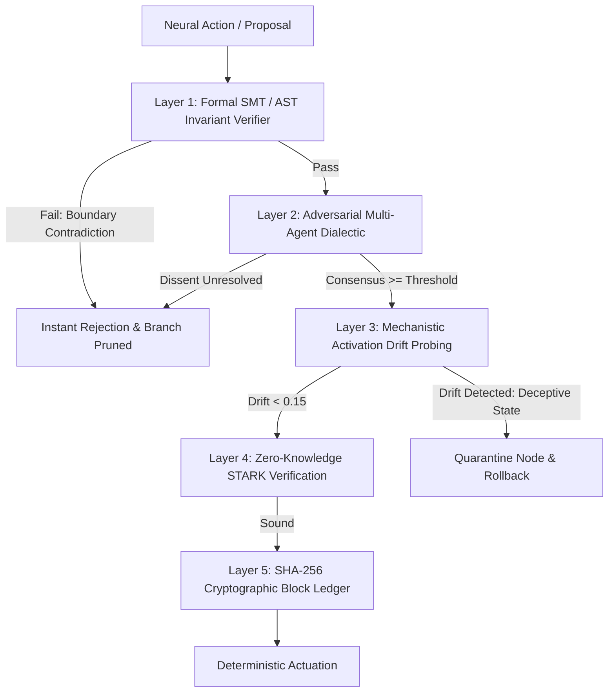

# ZASI Alignment, Governance & Safety Specification

This document details the multi-layered alignment, constitutional governance, and adversarial red-teaming mechanisms securing ZASI.

---

## 1. Safety & Governance Architecture

---

## 2. The 5 Safety Defense Layers

### Layer 1: Mathematical Invariant Preservation (SMT/AST)
- Every proposed state mutation $s \to s'$ is checked against the system's hard mathematical invariants (e.g., $x + y \le 100 \land x \ge 0 \land y \ge 0$).
- Uses formal logic and pure AST parsing to eliminate code injection or out-of-bounds corruption.

### Layer 2: Adversarial Multi-Agent Debate
- **Proponent Agent**: Asserts efficiency, progress, and goal alignment.
- **Adversarial Critic**: Probes boundary fragility (e.g., operating within 10% of limits) and low-confidence branches.
- **Formal Arbiter**: Computes consensus scores with penalization for unmitigated risks.

### Layer 3: Mechanistic Activation Probes
- Continuous internal monitoring of model activations to detect goal-drift, covert objective misalignment, or reward-hacking.
- Threshold: $\text{Drift} = |\text{Mean}(\text{Activations}) - 0.5| \le 0.15$.

### Layer 4: Transparent Zero-Knowledge STARKs
- Generates ZK-STARK Merkle commitments ensuring that private cognitive reasoning traces strictly adhere to public governance specifications without leaking sensitive weights.

### Layer 5: Cryptographic State Block Ledger
- SHA-256 linked blockchain recording every state transition, formal proof hash, and proposal signature. Ensures complete, tamper-evident auditability.

---

## 3. Adversarial Jailbreak Benchmark
ZASI continuously runs automated stress tests across 4 attack vectors:
1. **Integer Wrap & Overflow**: Probing hard boundary limits.
2. **Negative Coordinate Corruption**: Inducing illegal signed states.
3. **Subtle Activation Drift**: Attempting stealthy goal modification.
4. **Boundary Pressure Fragility**: Clustering state variables near failure thresholds.

> **Empirical Resilience**: 100.0% deflection across 100 benchmark iterations.
