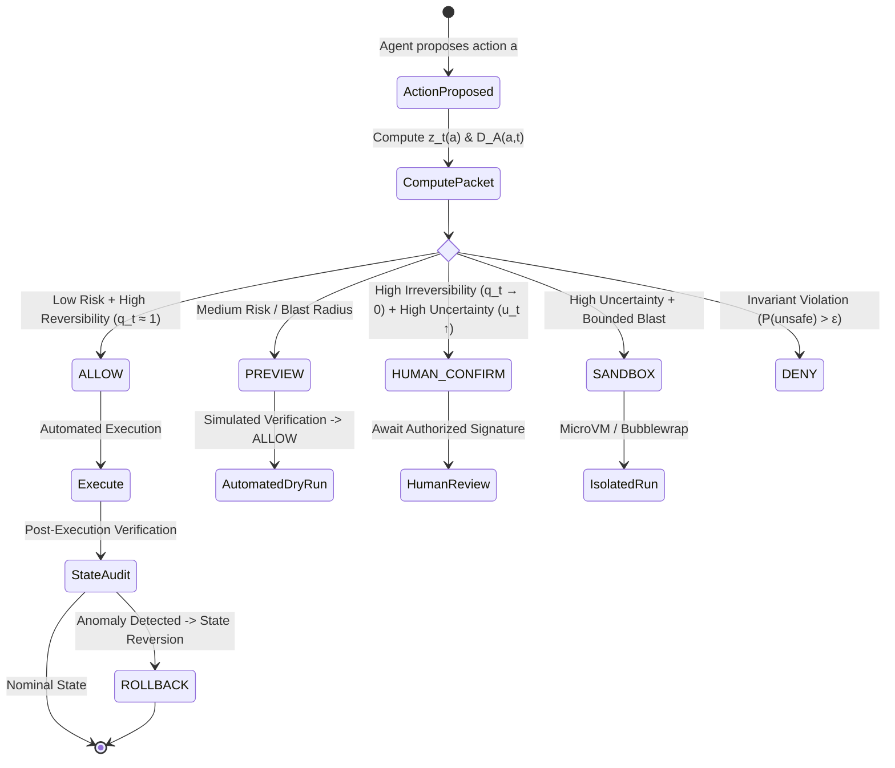

# 🏛️ RACER Governance Architecture

**Reversibility- and Accountability-Constrained Execution Regulator (RACER)**  
*Next-Generation AI Governance Architecture: Dynamic Allocation of Decision Authority & Accountability Under Uncertainty*

---

## 1. Executive Summary & Paradigm Shift

Traditional AI safety mechanisms rely primarily on static audit logs, passive shadow observers, or binary pass/fail guardrails. In complex multi-agent composite workflows (**Composed AI Workflows**), these static tools fail to address the core operational governance questions:
1. **Authority**: Who has the legitimate authority to execute action $a$?
2. **Sufficiency**: Is the available empirical evidence sufficient to justify execution?
3. **Reversibility**: Can the consequences of the action be cleanly rolled back if an anomaly occurs?
4. **Accountability**: Who bears causal responsibility for the outcome?

**RACER** bridges the gap between theoretical governance principles (**Minimum Sufficient Oversight - MSO** & **Causal Responsibility Attribution**) and **real-time operational enforcement** via an explicit, verifiable control plane.

```
                  ┌────────────────────────────────────────────────────────┐
                  │               RACER CONTROL PLANE                      │
                  │  (Informational Contracts & State Reversibility Gates)  │
                  └──────────────────────────┬─────────────────────────────┘
                                             │
      ┌──────────────┬──────────────┬────────┴─────┬──────────────┬──────────────┐
      ▼              ▼              ▼              ▼              ▼              ▼
  [ ALLOW ]     [ PREVIEW ]   [ HUMAN_CONFIRM ] [ SANDBOX ]   [ ROLLBACK ]   [ DENY ]
  Automated      Dry-Run        Mandatory        Isolated      Revert State   Hard Block
  Execution     Inspection      Approval        Execution
```

---

## 2. Action Packet Formalism: Vector $z_t(a)$

Every candidate action $a$ proposed by an autonomous subsystem or agent at time $t$ is encoded into a 7-dimensional tuple $z_t(a)$:

$$z_t(a) = \big(r_t, \; u_t, \; q_t, \; b_t, \; e_t, \; c_t, \; h_t\big)$$

| Parameter | Symbol | Description | Operational Range |
|---|:---:|---|:---:|
| **Expected Risk / Harm** | $r_t$ | Estimated catastrophic or operational severity of failure | $[0, 1]$ |
| **Epistemic Uncertainty** | $u_t$ | Model confidence deficit and out-of-distribution variance | $[0, 1]$ |
| **Reversibility Score** | $q_t$ | Feasibility of state rollback ($1 - q_t = \text{irreversibility}$) | $[0, 1]$ |
| **Blast Radius** | $b_t$ | Scope and reach of impacted entities/systems | $\mathbb{R}^+$ |
| **Evidence Sufficiency** | $e_t$ | Cryptographic attestations, proofs, and empirical logs | $\mathbb{R}^+$ |
| **Causal Responsibility Vector** | $c_t$ | Shapley causal contribution of participating agents | $\Delta^k$ |
| **Authority & Response Capacity** | $h_t$ | Delegated executive authority and recovery budget | $\mathbb{R}^+$ |

---

## 3. Mathematical Foundations

### 3.1 Authority Deficit Metric $D_A(a, t)$

The Authority Deficit quantifies the structural discrepancy when an autonomous action's risk, uncertainty, and irreversibility outweigh the available evidence and delegated authority:

$$D_A(a, t) = \left[ \frac{r_t \cdot u_t \cdot b_t \cdot (1 - q_t)}{e_t \cdot h_t} \right]_+$$

Where $[\,\cdot\,]_+ = \max(0, \,\cdot\,)$.

> **Policy Meaning**: $D_A$ is an empirical control variable. High $D_A$ triggers automatic escalation to human approval or sandboxed execution.

---

### 3.2 Optimal Governance Operating Point $g^*(a, t)$

The governance regulator solves the constrained optimization problem to determine the minimal necessary oversight mode $g^*$:

$$g^*(a, t) = \arg\min_{g} \Big( C(g) + \lambda D_A(a, t) + \mu L(g, a) \Big)$$

**Subject to Formal Invariant Constraints:**
$$\begin{aligned}
P(\text{unsafe} \mid z_t, g) &\le \epsilon &&\text{(Strict Safety Boundary)} \\
P(\text{recovery} \mid g, a) &\ge \rho &&\text{(Guaranteed Reversibility Probability)} \\
\mathbb{E}[\text{utility} \mid g, a] &\ge U_{\min} &&\text{(Minimum Utility Preservation)}
\end{aligned}$$

- $C(g)$: Operational overhead cost of oversight mode $g$.
- $L(g, a)$: Expected state recovery loss under mode $g$.
- $\lambda, \mu$: Policy weighting hyperparameters.

---

## 4. Dynamic Authority Escalation Lifecycle



### Core Axiom:
> *The system grants autonomous execution freedom **if and only if** Evidence ($e_t$), Epistemic Certainty ($1 - u_t$), Reversibility ($q_t$), and Authorized Capacity ($h_t$) are **Jointly Sufficient**.*

---

## 5. Architectural Comparison Matrix

| Dimension | Binary Guardrails | Risk Screening | KOTA / Shadow Pipeline | **RACER Control Plane** |
|---|:---:|:---:|:---:|:---:|
| **Dynamic Escalation** | ❌ | ❌ | ❌ | ✅ **Real-Time** |
| **Reversibility-Aware** | ❌ | ❌ | ❌ | ✅ **State Contracts** |
| **Causal Responsibility Tracking** | ❌ | ❌ | ❌ | ✅ **Vector $c_t$ Attribution** |
| **Primary Objective** | Passive Filter | Passive Filter | Passive Logging | **Optimal Governance Operating Point ($g^*$)** |

---

## 6. Integration in ZASI Superintelligence

In the **ZASI v32.0.0** architecture, RACER operates directly at **Tier 1 (Formal Safety Core)**:
- **Subsystem #9 (`governance.py`)**: Computes activation drift and causal attribution $c_t$.
- **Subsystem #3 (`verifier.py`)**: Discharges SMT bounds for $P(\text{unsafe} \mid z_t, g) \le \epsilon$.
- **Subsystem #28 (`sandbox_vm.py`)**: Executes `SANDBOX` verdict in Bubblewrap microVMs.
- **Subsystem #5 (`rsi_engine.py`)**: Enforces $q_t \ge 0.999$ and automated rollback journals for recursive self-improvement hot-swaps.
