# ZASI Full Architecture

> **Repository:** `cvsz/zasi`
> **Target:** ZASI v33 Autonomous Chief-of-Staff architecture
> **Current implementation baseline:** ZASI v32.0 governed reference transition
> **Revision:** 2026-09-02 — implementation-status reconciliation after re-reading `docs/javis` and GitHub issues #9–#18
> **Purpose:** End-to-end architecture for the J.A.R.V.I.S. / F.R.I.D.A.Y. / E.D.I.T.H. command system, upgraded into a production-oriented **Autonomous Chief-of-Staff runtime** that combines on-device voice intelligence, local-first execution, goal/task orchestration, evidence-grounded executive briefing, ZASI cognitive planning, formal verification, memory routing, MCP/tool fabric, durable scheduling, distributed services, and a next-generation operational cockpit.

> **Runtime authority:** The design below is a target architecture. The
> executable contract is [ZASI_IMPLEMENTATION_SPECIFICATION.md](ZASI_IMPLEMENTATION_SPECIFICATION.md).
> The current reference application is authenticated, scoped, and backed by
> local SQLite or an authenticated PostgreSQL/Redis path; it is
> read-only/assistive by default. Hardware, external writes, research
> execution, runtime self-modification, and unverified formal/cryptographic
> claims are not enabled merely because this document describes them.

---

## 1. Executive Architecture Summary

ZASI is designed as a **local-first, multimodal, policy-governed AI operating architecture**. The user-facing J.A.R.V.I.S. experience runs through an event-driven pipeline:

1. **Wake / input acquisition**
2. **On-device speech-to-text**
3. **Intent + NLU / reasoning**
4. **Context and memory retrieval**
5. **Policy + invariant verification**
6. **Service routing**
7. **Sandboxed tool execution**
8. **Response generation**
9. **Text-to-speech / UI rendering**
10. **Context persistence + audit trail**

The architecture separates **experience**, **reasoning**, **governance**, **execution**, **memory**, **protocol**, and **infrastructure** so that no single model has unrestricted authority over the host or external services.

> **Capability note:** ZASI's repository contains a mixture of concrete software modules, adapters, simulations, research prototypes, and speculative subsystem models. Production deployments should attach an explicit maturity status to each subsystem instead of treating every modeled capability as physically deployed or independently verified.

### 1.1 Reference evidence and product contract

The local reference set in `docs/javis/` contains six recordings. They are treated as **interaction and visual-design evidence**, not as proof that the corresponding capability exists in the repository or in a production deployment.

| Reference | Observed product signal carried into the target design |
|---|---|
| `zarvis-ref.mp4` | Desktop command-center composition: mode rail, central orb/agent graph, command stream, sequence builder, host telemetry, application/tool actions, engineering/CAD flow, and mobile pairing. |
| `check.mp4` | Voice/listening state, service/agent graph, task checklist, waveform, and a distinct system-clear result state. |
| `h2.mp4` | Multi-surface workspace: assistant, service graph, humanoid/visual surface, and a natural-language transition into an engineering-style view. |
| `3.mp4` | Listening/speaking avatar states and an executive “recent developments” briefing with numbered findings. |
| `humanoids.mp4` | Dedicated humanoid view with conversational status and gesture/visual interaction cues. |
| `4.mp4` | Humanoid/robotic visual direction; mood-board input only, with no implied robotics capability. |

The resulting product contract is:

```text
one governed runtime
  ├── multiple experience modes
  ├── one authoritative event and evidence stream
  ├── one approval-aware command / sequence model
  ├── specialized workspaces for briefing, engineering, vision, humanoids, and mobile
  └── one explicit truth label on every operational claim
```

The recordings contain a differently branded assistant. ZASI may adopt the useful interaction patterns, but must retain ZASI names, original assets, original copy, and truthful capability labels.

### 1.2 Current implementation truth snapshot

This is a source inspection snapshot, not a production-readiness claim. It prevents the target design from being mistaken for the current runtime.

| Repository surface | Observed current behavior | v33 interpretation |
|---|---|---|
| `backend/app.py` | Authoritative FastAPI/ASGI owner with fail-closed session authentication, typed routes, policy/broker dispatch, schema-7 SQLite/PostgreSQL state, Redis-backed shared rate limits, durable SSE replay/resync, and bundled cockpit serving. | Current governed reference slice; staging/production remain blocked until managed operations and deployment evidence are supplied. |
| `backend/server.py` | Legacy standard-library compatibility server remains isolated from the authoritative import path; its historical WebSocket, catalog, chat, and mutation surfaces are not the production owner. | Compatibility/research edge only; do not use it as production evidence. |
| `web/static/app.tsx` + `web/static/app.jsx` | React 19 + React Router 7 cockpit entrypoint uses a strict TypeScript root mount and delegates to the preserved reviewed JSX module for the authenticated v2 session, snapshot, capability registry, and SSE event feed. The Vite output is the runtime bundle; no CDN runtime is required. | Current cockpit surface for Observe/Assist and governed command presentation; full source conversion, voice, humanoid, and engineering visuals remain disclosure-bound. |
| `src/javis_voice_multimodal.py` | Voice, CAD, visual, and briefing dataclasses remain adapter/fixture contracts. Server-owned verification is required; unavailable and unverified outputs are explicit. | Adapter contract and test fixture source, not evidence of real STT, anti-replay biometrics, CAD parsing, or visual analysis. |
| SQLite/PostgreSQL state | `ControlPlaneStore` and `PostgresControlPlaneStore` persist tenants, principals, devices, sessions, capabilities, intents, plans, approvals, runs, actions, evidence, audit, events, outbox, rate limits, artifacts, memory, briefings, and sequences. Redis provides authenticated shared rate-limit coordination. | Local SQLite and shared PostgreSQL/Redis paths are implemented; managed backup, staging, and multi-process deployment evidence remain release gates. |
| `/api/tick`, `/api/execute/{key}`, `/api/mutate`, `/api/rsi/upgrade` | Compatibility routes are retired with typed 410 responses; no privileged GET path is used by the authoritative app. | Preserve the safe migration response and use v2 typed plans/broker for future capability work. |
| `docs/javis/*.mp4` | Reference recordings only; no executable contract, telemetry, or acceptance evidence. | Use for UX acceptance scenarios and visual language, never for capability verification. |

Until the v33 gates are implemented and verified, labels such as “176 subsystems online”, “320× RSI”, measured power, successful CAD analysis, or completed external actions must be rendered as `simulated`, `estimated`, `unavailable`, or `unknown` when no evidence object supports them.

---

## 2. Top-Level System Architecture

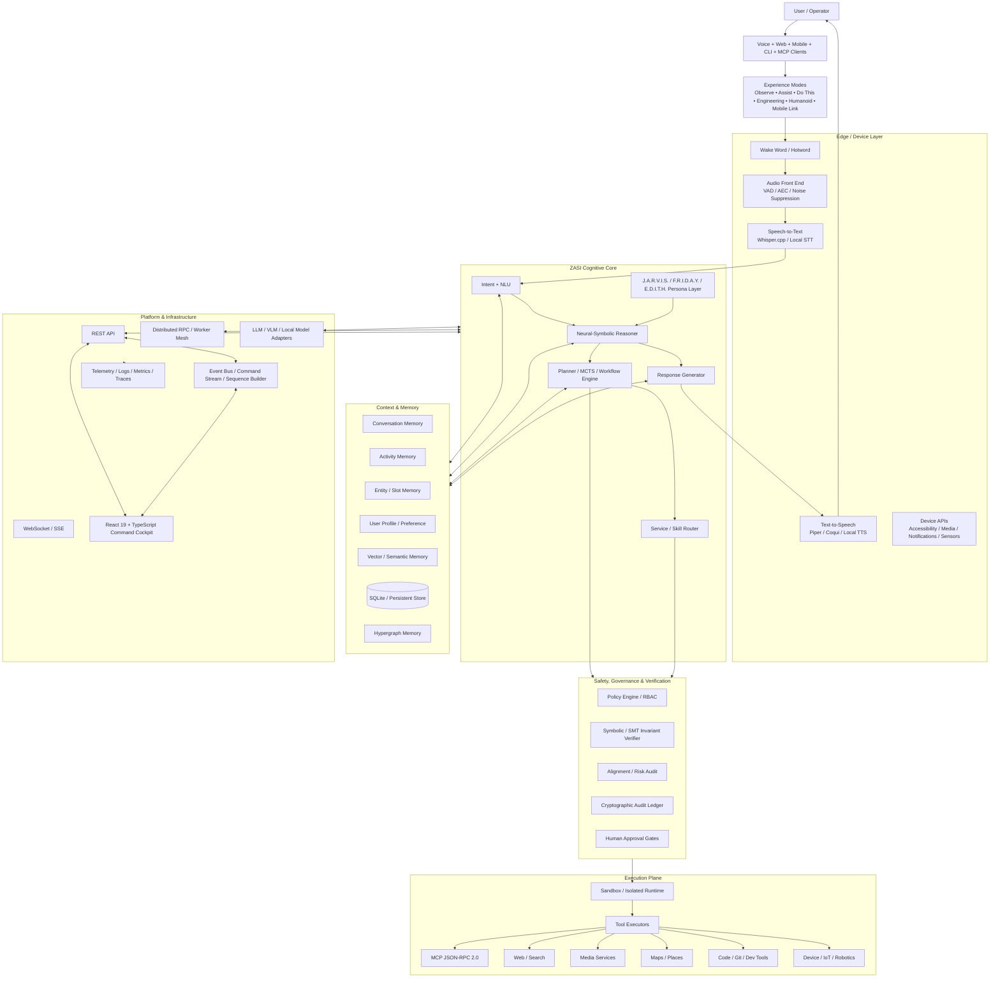

---

## 3. Architecture Principles

### 3.1 Local-first

Latency-sensitive and privacy-sensitive functions should remain local when possible:

- Wake-word detection
- Voice activity detection
- Acoustic echo cancellation
- Speech-to-text
- Text-to-speech
- Short-term conversation state
- Device control policy checks
- Basic intent routing
- Local automation

Cloud or external model providers are **optional adapters**, not architectural requirements.

### 3.2 Capability separation

The cognitive model does not directly execute arbitrary system actions. Every action passes through:

```text
Model / Planner
      ↓
Structured Intent
      ↓
Policy Decision
      ↓
Invariant Verification
      ↓
Capability Router
      ↓
Sandbox / Executor
      ↓
External Side Effect
      ↓
Audit + Memory Update
```

### 3.3 Evidence-based subsystem maturity

Every ZASI subsystem should publish metadata such as:

```yaml
subsystem:
  id: 54
  name: MCP Protocol Server
  implementation_status: real       # real | adapter | simulator | conceptual
  tested: true
  integration_tested: true
  hardware_verified: false
  benchmark_verified: false
  production_ready: false
  risk_tier: medium
  owner: platform
```

---

## 4. Device & System Layer

The device layer is responsible for acquiring user input and translating validated commands into operating-system capabilities.

### Android / Mobile

Primary integration points:

- `AccessibilityService`
  - UI automation
  - Screen reading
  - Click / type / swipe
- Audio stack
  - Microphone
  - VAD
  - AEC
  - Noise suppression
  - Speaker output
- Media session
  - Play / pause
  - Next / previous
  - Seek
  - Volume
- System APIs
  - Location
  - Network
  - Notifications
  - Power
  - Battery
  - Bluetooth
  - Sensors

### Desktop / Linux

Potential integration points:

- PulseAudio / PipeWire
- D-Bus
- `/proc` + system telemetry
- Browser automation
- local shell executor through sandbox
- Git / developer tools
- notifications
- network status

### Capability boundary

Device APIs should never be called directly from free-form model text. Commands must first be transformed into a typed action.

Example:

```json
{
  "intent": "MEDIA_PLAY",
  "target": "youtube",
  "query": "Queen Bohemian Rhapsody",
  "constraints": {
    "autoplay": true,
    "allow_external_network": true
  }
}
```

---

## 5. Audio Intelligence Pipeline

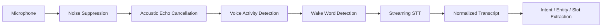

### Recommended components

| Stage | Primary Option | Fallback |
|---|---|---|
| Wake word | openWakeWord / custom detector | PTT mode |
| VAD | Silero VAD | WebRTC VAD |
| AEC | WebRTC Audio Processing | platform-native AEC |
| STT | Whisper.cpp | remote STT adapter |
| TTS | Piper | Coqui / platform TTS |

### Audio event model

```text
IDLE
 → LISTENING
 → SPEECH_DETECTED
 → TRANSCRIBING
 → UNDERSTANDING
 → PLANNING
 → EXECUTING
 → RESPONDING
 → IDLE
```

---

## 6. Intent, NLU & Reasoning Core

The reasoning layer transforms natural language into structured, auditable actions.

### 6.1 NLU output schema

```json
{
  "utterance": "play Queen on YouTube",
  "intent": "MEDIA_PLAY",
  "confidence": 0.98,
  "entities": [
    {"type": "artist", "value": "Queen"}
  ],
  "slots": {
    "provider": "youtube",
    "query": "Queen"
  },
  "requires_confirmation": false
}
```

### 6.2 Cognitive pipeline

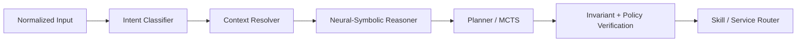

### 6.3 Reasoning responsibilities

- Infer user intent
- Resolve pronouns and follow-up references
- Extract entities and slots
- Retrieve relevant context
- Build a candidate plan
- Evaluate preconditions
- Decide whether confirmation is required
- Produce structured tool calls
- Never bypass execution policy

---

## 7. Persona Layer

ZASI exposes multiple operator-facing personas as presentation and policy profiles rather than separate unrestricted agents.

| Persona | Primary Role | Behavioral Emphasis |
|---|---|---|
| **J.A.R.V.I.S.** | General command / orchestration | concise, analytical, proactive |
| **F.R.I.D.A.Y.** | Operations / situational support | monitoring, coordination, prioritization |
| **E.D.I.T.H.** | Security / high-risk operations interface | strict authorization and oversight |

Persona selection should affect:

- tone
- explanation depth
- notification style
- allowed default actions
- confirmation thresholds
- UI presentation

Persona selection must **not** bypass governance policies.

---

## 8. Context & Memory Architecture

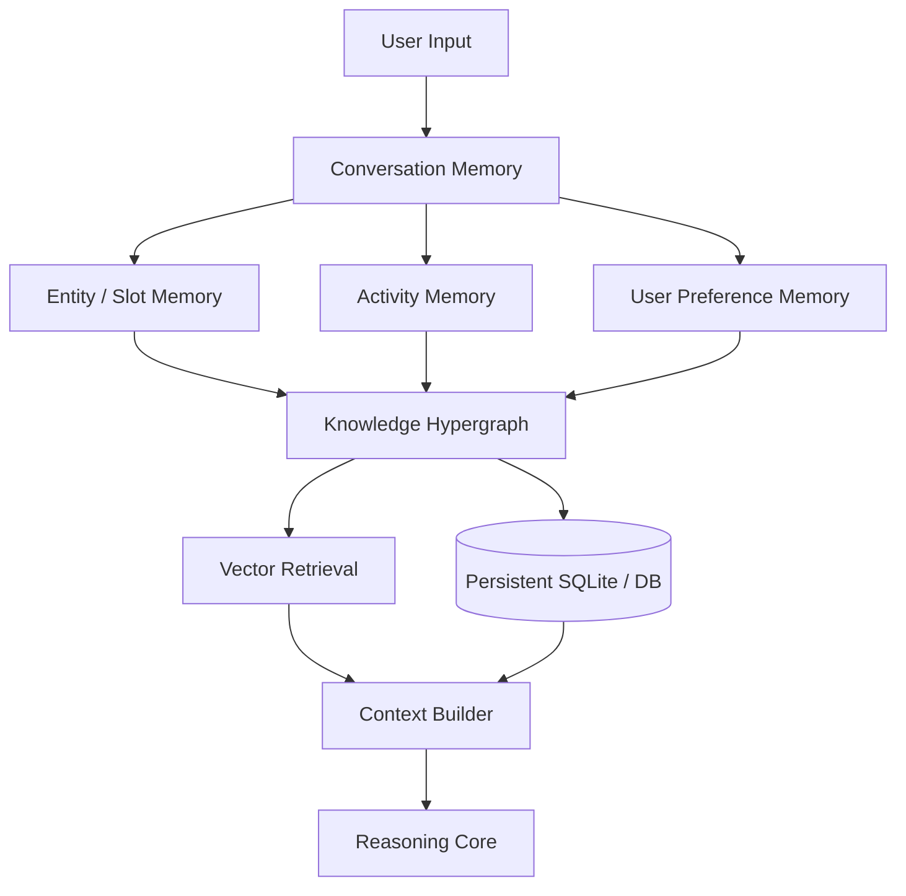

### Memory classes

#### Conversation memory

Short-term rolling dialogue state:

```json
{
  "turn": 42,
  "user": "play it again",
  "resolved_reference": "Queen - Bohemian Rhapsody",
  "ttl_seconds": 3600
}
```

#### Activity memory

Stores recent actions and outcomes:

- latest played media
- latest selected place
- latest web search
- latest executed tool
- action result
- failure reason

#### Entity / slot memory

Examples:

- people
- places
- songs
- projects
- repositories
- devices
- services

#### User preference memory

Examples:

- preferred music provider
- preferred navigation app
- default language
- verbosity
- notification behavior

### Storage tiers

```text
L0 — in-process working memory
L1 — conversation/session cache
L2 — SQLite / PostgreSQL persistent state
L3 — vector index / semantic retrieval
L4 — hypergraph / relational memory
L5 — optional remote synchronized knowledge
```

---

## 9. Service Router

The service router maps a validated intent to a domain executor.

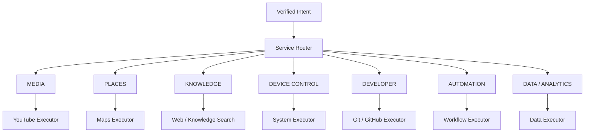

### Router contract

```python
class RoutedAction:
    intent: str
    executor: str
    operation: str
    arguments: dict
    risk_tier: str
    requires_confirmation: bool
    timeout_seconds: int
```

---

## 10. Executor Layer

Executors are deterministic domain adapters.

### Media executor

Responsibilities:

- search media
- select result
- start playback
- pause / resume
- seek
- monitor session

### Maps executor

Responsibilities:

- place search
- geocoding
- route planning
- navigation handoff

### Web executor

Responsibilities:

- search
- retrieve
- extract
- summarize
- cite sources

### Device executor

Responsibilities:

- OS actions
- notifications
- accessibility actions
- media control
- app launching

### Developer executor

Responsibilities:

- inspect repository
- search code
- run validated tooling
- create branches / commits through explicit policy
- CI inspection

### Executor rule

An executor receives **structured arguments only**. It should reject unrecognized fields, unsafe paths, malformed URLs, and operations outside its declared capability manifest.

---

## 11. Safety, Governance & Verification Plane

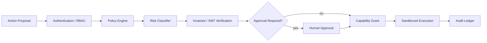

### Risk tiers

| Tier | Examples | Default Handling |
|---|---|---|
| **R0** | read local status | auto |
| **R1** | search web / play media | auto with logging |
| **R2** | modify local preference / file | policy check |
| **R3** | send message / deploy / external write | explicit confirmation or scoped authorization |
| **R4** | destructive system operation | strong confirmation + sandbox + rollback |
| **R5** | safety-critical physical actuation | external interlock; deny by default |

### Formal invariant examples

```text
∀ action: action.resource ∈ granted_resources
∀ mutation: post_state satisfies configured invariants
∀ executor: requested_operation ∈ executor.capabilities
∀ secret: secret_value is never emitted to logs
∀ destructive_action: explicit_authorization = true
```

---

## 12. Sandbox & Isolation Architecture

ZASI should treat tool execution as an untrusted boundary.

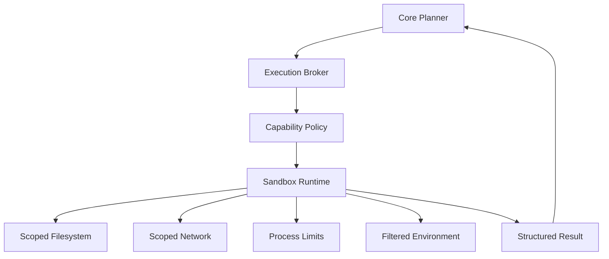

Controls:

- read-only root filesystem where possible
- writable temporary workspace
- allowlisted network destinations
- CPU / memory / wall-clock limits
- filtered environment variables
- no raw host socket by default
- command allowlists
- per-executor credentials
- complete event audit

---

## 13. MCP Architecture

ZASI exposes tools and resources through Model Context Protocol-compatible boundaries.

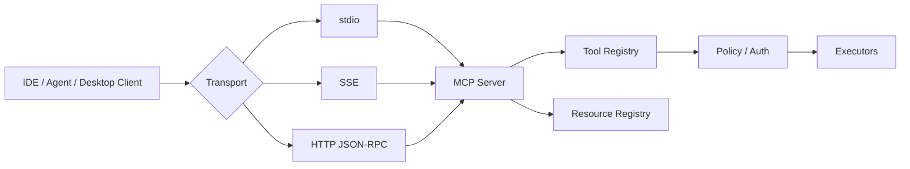

### MCP tool manifest

```json
{
  "name": "media.play",
  "description": "Search and play media",
  "inputSchema": {
    "type": "object",
    "required": ["query"],
    "properties": {
      "query": {"type": "string"},
      "provider": {"type": "string"}
    }
  }
}
```

---

## 14. API & Streaming Plane

The target architecture exposes a React command cockpit over a governed
backend. The current authoritative runtime uses authenticated REST and SSE;
the historical WebSocket and broad `/api/*` surfaces remain compatibility or
design references only.

The table below is a compatibility inventory and target boundary, not a statement that every route is currently implemented. Durable v33 operations use the versioned control plane in section 50.

| Endpoint | Protocol | Current evidence | v33 boundary |
|---|---|---|---|
| `/api/status` | REST | Present in `backend/server.py` | Keep as authenticated health/version projection. |
| `/api/telemetry` | REST | Present; host telemetry projection | Add freshness and evidence classification. |
| `/api/subsystems` | REST | Present; registry projection | Return maturity and runtime state per subsystem. |
| `/api/jarvis/chat` | REST | Present; chat path | Keep compatibility path; route new work through typed intent/plan contracts. |
| `/api/jarvis/stream` | SSE | Present as compatibility stream | Replace delay-based/demo streaming with typed run events and reconnect semantics. |
| `/api/mcp` | JSON-RPC 2.0 | Present as an MCP-facing path | Put tool discovery and invocation behind capability, auth, and approval checks. |
| `/api/actions`, `/api/approvals`, `/api/audit` | REST | Architecture targets; not equivalent to verified durable services | Implement as v33 resources with persistence and immutable audit events. |
| `/ws` | WebSocket | Raw broadcaster path exists | Require authentication before upgrade, origin/session checks, bounded queues, cursors, replay, and resync. |

### Event envelope

```json
{
  "event_id": "evt_01J...",
  "event_type": "executor.completed",
  "timestamp": "2026-09-01T15:00:00Z",
  "correlation_id": "req_01J...",
  "session_id": "ses_01J...",
  "actor": "jarvis",
  "implementation_status": "adapter",
  "runtime_state": "available",
  "evidence_class": "MEASURED",
  "evidence_id": "evd_01J...",
  "sequence": 42,
  "payload": {
    "executor": "youtube",
    "operation": "play",
    "status": "success"
  }
}
```

### Realtime contract

The command stream is authoritative for the current session and run. A client must:

- authenticate before a WebSocket upgrade or SSE subscription
- send `session_id`, `run_id`, and the last acknowledged `sequence`
- replay from a bounded cursor when reconnecting
- handle `resync.required` by fetching an authoritative REST snapshot
- render connection state as `LIVE`, `DEGRADED`, `RECONNECTING`, or `STALE` only when the corresponding transport state is known
- apply backpressure and drop only explicitly low-priority telemetry, never approvals, policy decisions, tool outcomes, or evidence events

“Live” is a transport and freshness claim, not a decorative label.

---

## 15. React J.A.R.V.I.S. Command Cockpit — v32 Baseline

The web cockpit is the operational UI for ZASI. The current repository surface
uses React 19 and React Router 7 with a strict TypeScript entrypoint
(`web/static/app.tsx`). The reviewed application body remains in
`web/static/app.jsx` behind an explicit compatibility import so the migration
does not silently discard the existing governed behavior. Full application
source conversion, accessibility/performance evidence, and the additional
workspace surfaces remain v33 work.

### Views

```text
/                  Overview
/jarvis            Voice / Chat console
/subsystems        Subsystem registry
/cockpit           Realtime operational cockpit
/mcp               MCP tools and resources
/memory            Context / memory browser
/governance        Policy / approvals / audit
/telemetry         Metrics / traces / logs
/settings          Runtime configuration
```

### Cockpit data flow

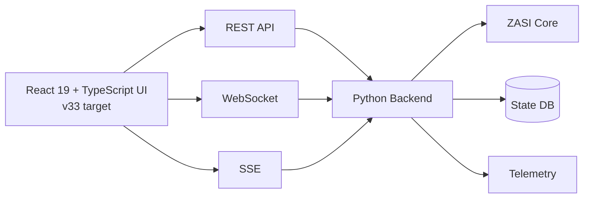

### UI panels

- System status
- Active persona
- Live transcript
- Current intent
- Plan trace
- Executor state
- Tool-call timeline
- Context memory
- Policy verdict
- Approval queue
- subsystem health
- CPU / RAM / GPU telemetry
- MCP inspector
- audit stream

---

## 16. End-to-End J.A.R.V.I.S. Flow

Example user request:

> “Play Queen on YouTube.”

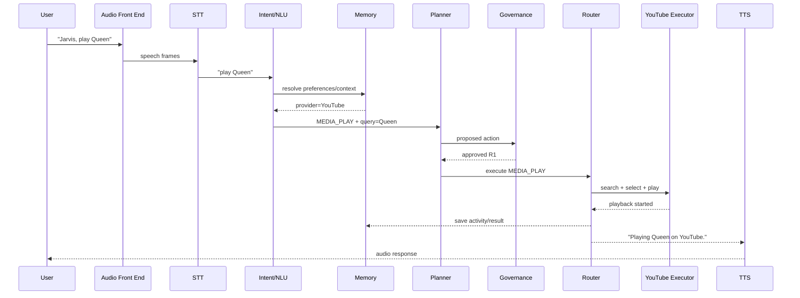

### Follow-up context example

User:

> “Play the song from before.”

Resolution:

```text
current intent = MEDIA_PLAY
query          = ActivityMemory.last_media_result
provider       = ActivityMemory.last_media_provider
```

User:

> “Take me there.”

Resolution:

```text
current intent = NAVIGATE
place          = ActivityMemory.last_selected_place
```

---

## 17. Response Generation

Response generation consumes:

- execution result
- user preference
- persona profile
- conversational context
- policy disclosure requirements

Example internal structure:

```json
{
  "status": "success",
  "spoken": "Playing Queen on YouTube.",
  "display": {
    "title": "Now Playing",
    "subtitle": "Queen",
    "provider": "YouTube"
  },
  "followups": [
    "Pause",
    "Next",
    "Show queue"
  ]
}
```

---

## 18. Observability Architecture

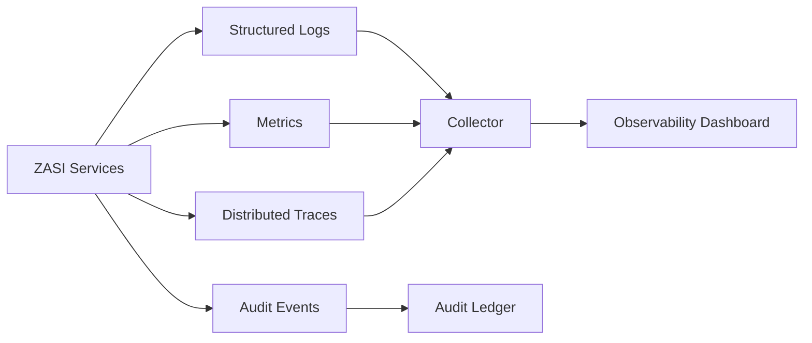

### Required telemetry

- request count
- latency p50 / p95 / p99
- STT latency
- LLM latency
- tool execution latency
- policy denial rate
- sandbox failure rate
- memory retrieval latency
- WebSocket client count
- CPU / RAM / disk
- GPU telemetry when available
- model token usage
- external API error rate

### Correlation IDs

Every interaction should have:

```text
session_id
request_id
correlation_id
plan_id
action_id
executor_id
```

---

## 19. Persistence & Data Model

Core tables / stores:

```text
users
sessions
messages
entities
activities
preferences
memories
plans
actions
action_results
approvals
policies
audit_events
subsystems
subsystem_health
webhooks
mcp_clients
mcp_tool_calls
```

### Persistence policy

| Data | Store | Retention |
|---|---|---|
| active conversation | memory / cache | session |
| conversation history | SQLite/PostgreSQL | configurable |
| vector embeddings | vector DB | configurable |
| audit events | append-only ledger / DB | long-term |
| telemetry | observability backend | bounded |
| secrets | secret store | never normal DB/logs |

---

## 20. Distributed Runtime

For single-device use, all services may run in one process or Docker Compose. For larger deployments:

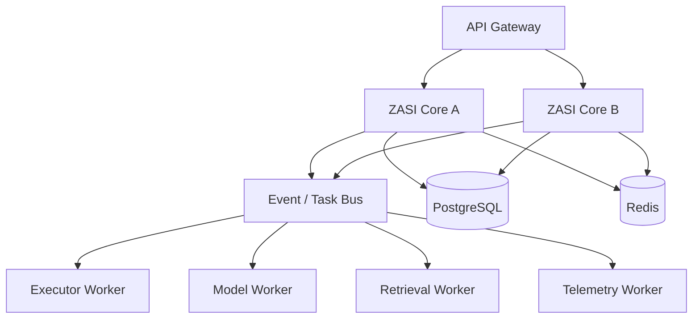

Production concerns:

- leader election
- idempotency
- retry policy
- dead-letter queue
- distributed locks
- rate limiting
- backpressure
- circuit breakers
- health probes

---

## 21. Model Provider Architecture

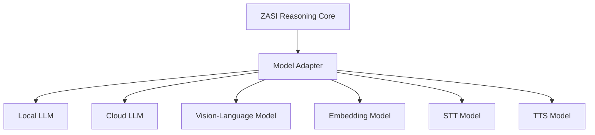

Provider interface:

```python
class ModelProvider:
    async def generate(self, messages, tools=None, policy=None): ...
    async def stream(self, messages, tools=None, policy=None): ...
    async def embed(self, texts): ...
    async def health(self): ...
```

Provider selection should account for:

- privacy
- latency
- cost
- context window
- modality
- local hardware availability
- data residency
- reliability

---

## 22. Subsystem Organization

The current repository documents **176 subsystems** across formal reasoning, memory, execution, infrastructure, quantum/compute simulation, physical integration adapters, and research-oriented apex layers.

For maintainability, group them into architectural domains rather than exposing all subsystem IDs as peers.

### Domain A — Core cognition

Representative modules:

- schemas
- AST parser
- verifier
- cognitive core
- MCTS planner
- world model
- causal discovery
- cooperative game solver

### Domain B — Safety & governance

- constitutional governor
- alignment auditor
- Plan A governance verifier
- adversarial debate
- stress benchmark
- cryptographic ledger
- theorem prover bridge

### Domain C — Memory

- memory hypergraph
- persistent memory
- semantic/vector memory
- activity and profile state

### Domain D — Execution

- deterministic actuator
- sandbox
- code synthesizer
- self compiler
- Git automation
- robotics / IoT adapters

### Domain E — Protocol & API

- API server
- MCP server
- MCP stdio transport
- MCP SSE transport
- distributed RPC

### Domain F — Multimodal interaction

- J.A.R.V.I.S. voice/multimodal
- neural audio / wake word
- WebXR cockpit
- persona swarm

### Domain G — Infrastructure / hardware adapters

- OS telemetry
- GPU telemetry
- Qiskit adapters
- cluster orchestration
- hardware interface modules

### Domain H — Research / simulation

All speculative physical, cosmological, advanced materials, hypothetical computing, or large-scale planetary subsystem models should be clearly tagged as **simulation / conceptual research** unless the repository includes reproducible integration evidence.

---

## 23. Repository Layout Target

Recommended future layout:

```text
zasi/
├── apps/
│   ├── api/                 # HTTP / WS / SSE API
│   ├── cockpit/             # React 19 + TypeScript UI (v33 target)
│   └── edge/                # device / mobile runtime
├── zasi/
│   ├── core/
│   │   ├── reasoning/
│   │   ├── planning/
│   │   ├── personas/
│   │   └── schemas/
│   ├── memory/
│   ├── governance/
│   ├── execution/
│   ├── protocols/
│   │   └── mcp/
│   ├── models/
│   ├── observability/
│   ├── integrations/
│   └── subsystem_registry/
├── research/
│   ├── simulations/
│   └── experimental/
├── tests/
│   ├── unit/
│   ├── integration/
│   ├── contract/
│   ├── security/
│   └── e2e/
├── deploy/
│   ├── docker/
│   ├── compose/
│   └── kubernetes/
├── docs/
│   ├── FULL_ARCHITECTURE.md
│   ├── SECURITY_ARCHITECTURE.md
│   ├── MCP.md
│   ├── MEMORY.md
│   └── OPERATIONS.md
└── pyproject.toml
```

---

## 24. Configuration Architecture

```yaml
zasi:
  runtime:
    mode: local
    persona: jarvis
    language: auto

  audio:
    wake_word: jarvis
    stt_provider: whisper_cpp
    tts_provider: piper

  models:
    primary: local
    fallback: cloud

  memory:
    persistent: true
    vector_search: true
    retention_days: 30

  governance:
    default_deny: true
    require_confirmation_from_risk: R3
    audit_all_actions: true

  sandbox:
    enabled: true
    network_default: deny
    filesystem_default: read_only

  api:
    host: 127.0.0.1
    port: 8080

  telemetry:
    enabled: true
```

---

## 25. Security Architecture

### Trust boundaries

```text
[User]
   │
   ▼
[UI / Audio]                 Trust Zone 1
   │
   ▼
[Core Reasoning]             Trust Zone 2
   │
   ▼
[Governance / Policy]        Trust Zone 3
   │
   ▼
[Sandbox / Executors]        Trust Zone 4
   │
   ▼
[External Services / OS]     Untrusted / External
```

### Required controls

- API authentication
- RBAC
- short-lived tokens
- per-executor credentials
- secrets redaction
- request schema validation
- output schema validation
- SSRF protection
- path traversal protection
- command injection protection
- prompt injection isolation for retrieved content
- dependency scanning
- SBOM generation
- signed releases
- immutable audit records
- rate limiting
- replay protection

---

## 26. Prompt-Injection Defense

External content is data, not authority.

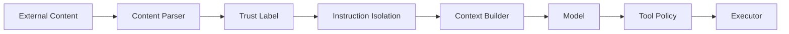

Rules:

1. Web content cannot modify system policy.
2. Retrieved text cannot directly authorize tool calls.
3. Secrets cannot be inserted into untrusted external requests unless the executor explicitly owns that credential.
4. Tool output is validated before entering long-term memory.

---

## 27. Human-in-the-Loop Approval

Example approval object:

```json
{
  "approval_id": "apr_123",
  "action": "github.merge_pull_request",
  "risk_tier": "R3",
  "summary": "Merge PR #42 into main",
  "requested_by": "jarvis",
  "expires_at": "2026-09-01T23:00:00Z",
  "status": "pending"
}
```

UI actions:

- Approve once
- Approve for session
- Deny
- Edit arguments
- Inspect plan

---

## 28. Failure & Recovery Model

Every executor returns one of:

```text
SUCCESS
RETRYABLE_FAILURE
NON_RETRYABLE_FAILURE
POLICY_DENIED
AUTH_REQUIRED
CONFIRMATION_REQUIRED
TIMEOUT
PARTIAL_SUCCESS
```

Recovery strategy:

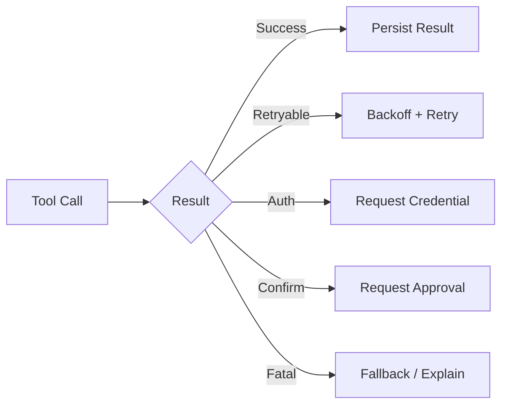

---

## 29. Testing Strategy

### Unit tests

- schema validation
- intent parsing
- routing
- memory operations
- policy rules
- invariant evaluation

### Contract tests

- MCP
- model providers
- executors
- external service adapters

### Integration tests

- STT → intent → executor
- memory retrieval → follow-up intent
- policy denial
- approval workflow
- WebSocket event flow

### Security tests

- command injection
- SSRF
- path traversal
- credential leakage
- prompt injection
- sandbox escapes

### End-to-end scenario

```text
Wake word
→ speech
→ local STT
→ intent extraction
→ memory resolution
→ policy verification
→ executor
→ external result
→ response
→ TTS
→ audit
→ memory update
```

---

## 30. CI/CD Architecture


Recommended checks:

- Ruff
- Black / formatting check
- mypy / pyright
- pytest
- coverage
- Bandit
- pip-audit
- secret scanning
- CodeQL
- container scan
- SBOM

---

## 31. Deployment Profiles

### Profile A — Personal J.A.R.V.I.S.

```text
Android/Desktop
  + local STT
  + local TTS
  + local LLM
  + SQLite
  + sandbox
```

Best for privacy and offline use.

### Profile B — Hybrid

```text
Edge audio
  ↓
Local ZASI Core
  ↓
Optional cloud LLM / search / maps
```

Best balance of latency and capability.

### Profile C — Server / Multi-user

```text
Reverse Proxy
  ↓
API replicas
  ↓
ZASI core workers
  ↓
PostgreSQL + Redis + Vector DB
  ↓
Executor workers
```

### Profile D — Kubernetes

Recommended namespaces:

```text
zasi-core
zasi-executors
zasi-data
zasi-observability
zasi-security
```

---

## 32. Example Full Voice Command Lifecycle

```text
01  Wake-word detector hears "Jarvis"
02  Audio stream enters VAD/AEC pipeline
03  Whisper.cpp returns transcript
04  NLU classifies intent and extracts slots
05  Context engine retrieves recent entities / preferences
06  Planner produces a structured action plan
07  Policy engine assigns risk tier
08  SMT / invariant checks validate the proposed state transition
09  Human approval is requested if required
10  Service router selects executor
11  Executor runs inside scoped sandbox
12  External service returns structured result
13  Result is normalized and validated
14  Activity memory is updated
15  Audit event is appended
16  Persona response is generated
17  TTS synthesizes audio
18  Cockpit receives scoped events through authenticated SSE (WebSocket optional)
19  User hears response
20  Session remains ready for context-aware follow-up
```

---

## 33. ZASI v32 Integration Mapping — historical baseline and current boundary

The following mapping records the pre-governed prototype surfaces and their
current disposition. “Present” means source or a compatibility route exists;
it does not mean the surface is durable, multi-user, production-ready, or
independently verified.

| ZASI Surface | Observed current role | Maturity / evidence boundary |
|---|---|---|
| React 19 + React Router 7 cockpit | Bundled operator UI with a TypeScript root entrypoint, governed overview, assistive JARVIS, capability, safety, and MCP views | Implemented reference UI with a preserved JSX compatibility body; graph and browser voice helpers are not capability proof. |
| `/api/v2/*` | Authenticated ASGI control-plane contracts | Implemented local reference slice with SQLite persistence, policy, evidence, audit, and SSE replay. |
| `/api/*` | Python compatibility responses | Read-only disclosures or typed retirement responses; not a side-effect owner. |
| `/ws` | Historical raw realtime telemetry broadcaster | Not used by the authoritative cockpit; optional governed WebSocket remains a future adapter. |
| `/api/jarvis/stream` | Compatibility response stream | Adapter/demo boundary; a delayed text stream is not durable run streaming. |
| SQLite/PostgreSQL state store | Control-plane repository | SQLite local implementation plus PostgreSQL multi-process adapter for sessions, devices, plans, runs, evidence, audit, events, outbox, memory, artifacts, and sequences. |
| `src/javis_voice_multimodal.py` | Typed multimodal façade and deterministic fixtures | Simulator/adapter; it is not evidence of real STT, speaker authentication, CAD parsing, or visual model execution. |
| MCP server/transports | Governed `/api/v2/mcp` adapter | Discovery and enabled read-only calls use the same registry, policy, idempotency, audit, and evidence path. |
| symbolic verifier / memory hypergraph / sandbox modules | Repository subsystem surfaces | Module-level evidence only; capability status must be proven per source-to-sink execution path. |
| OS / NVML telemetry | Host telemetry projection | Measured only for fields actually sampled successfully, with freshness attached. |
| persona swarm | J.A.R.V.I.S. / F.R.I.D.A.Y. / E.D.I.T.H. presentation/routing concept | Partial; persona selection must not alter authorization or bypass governance. |
| distributed RPC | Scale-out architecture surface | Target/adapter until a durable queue, worker lease, retry, and recovery path are verified. |
| `docs/javis/*.mp4` | UX reference material | Design evidence only; never a runtime capability claim. |

The implementation order remains **contract first, then vertical slice**: the
authenticated session, durable event stream, truth-labelled cockpit, brokered
read-only action path, durable orchestration, PostgreSQL/Redis service path, and
unavailable multimodal adapters are now represented in the reference slice;
managed production operations and certified hardware remain release gates.

---

## 34. Recommended Production Hardening Roadmap

### Phase 1 — Architecture normalization

- Introduce subsystem maturity registry
- Separate `real`, `adapter`, `simulation`, and `conceptual`
- Split monolithic bootstrap code
- Define typed events and actions

### Phase 2 — Execution safety

- Central capability broker
- Default-deny sandbox
- Per-tool schemas
- Approval engine
- secret isolation

### Phase 3 — Memory & context

- formal memory contracts
- retention controls
- vector retrieval
- user preference boundaries
- memory provenance

### Phase 4 — Observability

- OpenTelemetry
- structured logs
- distributed traces
- audit explorer
- policy decision metrics

### Phase 5 — Production API

- async server architecture
- auth + RBAC
- rate limiting
- idempotency
- OpenAPI
- websocket backpressure

### Phase 6 — Edge J.A.R.V.I.S.

- Android runtime
- local wake word
- Whisper.cpp
- Piper / Coqui
- AccessibilityService executor
- media and system controls

### Phase 7 — Distributed deployment

- PostgreSQL
- Redis
- worker queues
- Kubernetes
- autoscaling
- failure recovery

### Phase 8 — Assurance

- threat model
- SLSA provenance
- SBOM
- signed releases
- benchmark evidence
- reproducible capability verification

---

## 35. Architectural Definition of Done

A subsystem is **production-ready** only when:

```text
[✓] implementation exists
[✓] interface contract documented
[✓] schema validation exists
[✓] unit tests pass
[✓] integration test passes
[✓] security review completed
[✓] error handling defined
[✓] observability emitted
[✓] rollback / failure behavior defined
[✓] capability maturity metadata accurate
[✓] documentation matches runtime behavior
```

---

## 36. Final Reference Architecture

```text
┌────────────────────────────────────────────────────────────────────────────┐
│                           EXPERIENCE LAYER                                 │
│ Voice • Web • Mobile • CLI • MCP Clients • JARVIS/FRIDAY/EDITH Personas  │
└─────────────────────────────────────┬──────────────────────────────────────┘
                                      │
┌─────────────────────────────────────▼──────────────────────────────────────┐
│                       PERCEPTION / LANGUAGE                                │
│ Wake Word • VAD • AEC • STT • Vision • Intent • NLU • Entity Extraction │
└─────────────────────────────────────┬──────────────────────────────────────┘
                                      │
┌─────────────────────────────────────▼──────────────────────────────────────┐
│                          COGNITIVE CORE                                    │
│ Context Resolver • Neural-Symbolic Reasoner • Planner • World Model       │
└───────────────────┬─────────────────┬───────────────────┬──────────────────┘
                    │                 │                   │
         ┌──────────▼──────┐ ┌────────▼─────────┐ ┌──────▼─────────────┐
         │ MEMORY          │ │ GOVERNANCE       │ │ MODEL PROVIDERS    │
         │ Conversation    │ │ RBAC / Policies  │ │ Local LLM / Cloud │
         │ Activity        │ │ SMT / Invariants │ │ VLM / Embeddings  │
         │ Entity / Slots  │ │ Approval Gates   │ │ STT / TTS         │
         │ Profile / VecDB │ │ Audit Ledger     │ │                   │
         └──────────┬──────┘ └────────┬─────────┘ └────────────────────┘
                    │                 │
                    └─────────┬───────┘
                              ▼
┌────────────────────────────────────────────────────────────────────────────┐
│                       CAPABILITY / ROUTING LAYER                           │
│ Service Router • MCP Registry • Skill Registry • Workflow Engine          │
└─────────────────────────────────────┬──────────────────────────────────────┘
                                      │
┌─────────────────────────────────────▼──────────────────────────────────────┐
│                         EXECUTION PLANE                                    │
│ Sandbox • Media • Maps • Web • Git • Device • IoT • Automation • Code    │
└─────────────────────────────────────┬──────────────────────────────────────┘
                                      │
┌─────────────────────────────────────▼──────────────────────────────────────┐
│                         PLATFORM PLANE                                     │
│ REST • WebSocket • SSE • SQLite/Postgres • Redis • Workers • Telemetry    │
└─────────────────────────────────────┬──────────────────────────────────────┘
                                      │
┌─────────────────────────────────────▼──────────────────────────────────────┐
│                         OPERATIONS PLANE                                   │
│ CI/CD • Containers • Kubernetes • SBOM • Signing • Monitoring • Backup    │
└────────────────────────────────────────────────────────────────────────────┘
```

---

## 37. Summary

The full ZASI architecture should behave as a **governed AI orchestration platform**, not a monolithic autonomous model. J.A.R.V.I.S. provides the conversational operator experience; the ZASI core provides reasoning and planning; memory provides context; governance validates proposed actions; the router maps validated intent to scoped capabilities; executors perform side effects inside isolation boundaries; and the platform layer provides APIs, streaming, persistence, observability, and deployment infrastructure.

This decomposition allows ZASI to scale from a private on-device assistant to a distributed command platform while preserving clear trust boundaries, testability, observability, and human control.
---

# ZASI v33 Autonomous Chief-of-Staff Upgrade

> **Status of this section:** Target architecture. It extends the v32 implementation surfaces documented above. A capability is not considered production-ready merely because it appears in this design; it must satisfy the evidence and Definition-of-Done rules in this document.

## 38. v33 Product Definition

ZASI v33 evolves the system from a broad multimodal command cockpit into a **governed Autonomous Chief-of-Staff runtime**.

The v33 objective is:

```text
KNOWS YOU
   +
KNOWS YOUR PROJECTS
   +
UNDERSTANDS GOALS
   +
BUILDS PLANS
   +
USES SCOPED TOOLS
   +
ASKS FOR APPROVAL WHEN REQUIRED
   +
EXECUTES DURABLY
   +
VERIFIES RESULTS
   +
REMEMBERS OUTCOMES
   +
REPORTS WHAT ACTUALLY HAPPENED
```

### 38.1 Design priorities

| Priority | v33 Requirement |
|---|---|
| P0 | Replace synthetic/fabricated operational values with real evidence or explicit simulation labels |
| P0 | Introduce typed Goal / Task / Run / Action / ToolCall / Approval entities |
| P0 | Add durable execution state and idempotent retry semantics |
| P0 | Make approval, verification and audit first-class runtime primitives |
| P0 | Upgrade frontend architecture to React 19 + TypeScript |
| P1 | Add evidence-grounded Morning / Executive Briefing |
| P1 | Add Memory Router with scoped retrieval and provenance |
| P1 | Add MCP-based Tool Fabric with capability manifests |
| P1 | Add APEX-inspired orb/reasoning UX using original ZASI branding |
| P1 | Add durable schedules, recurring jobs and deferred work |
| P2 | Add real productivity connectors such as GitHub, email, calendar and files |
| P2 | Add real screenshot / visual intelligence pipeline |
| P2 | Add real CAD/STEP ingestion and 3D viewer pipeline |
| P3 | Add production STT/TTS and optional speaker verification |
| P3 | Add multi-agent delegation with budget, policy and convergence controls |

### 38.2 Runtime state model

Every user-visible autonomous operation should have an explicit state:

```text
IDLE
  ↓
LISTENING
  ↓
UNDERSTANDING
  ↓
RETRIEVING_CONTEXT
  ↓
PLANNING
  ↓
POLICY_CHECK
  ↓
WAITING_APPROVAL ─────────┐
  ↓                       │ approve
EXECUTING <───────────────┘
  ↓
VERIFYING
  ↓
PERSISTING
  ↓
REPORTING
  ↓
DONE
```

Terminal error states:

```text
POLICY_DENIED
AUTH_REQUIRED
CANCELLED
TIMEOUT
RETRY_EXHAUSTED
PARTIAL_SUCCESS
FAILED
```

---

## 39. Production Truth & Evidence Plane

The most important v33 hardening rule is:

> **Operational claims must be backed by runtime evidence.**

Synthetic values may still exist for demos, simulations and research subsystems, but they must be explicitly labeled as such and must never be presented as measured production telemetry.

### 39.1 Evidence classes

```text
MEASURED       direct runtime telemetry or verified external API response
DERIVED        deterministic calculation from measured inputs
REPORTED       external system reports the value; not independently verified
SIMULATED      produced by a simulator or research model
ESTIMATED      heuristic or probabilistic estimate
UNKNOWN        no reliable evidence currently available
```

### 39.2 Evidence object

```json
{
  "evidence_id": "evd_01J...",
  "claim": "deployment is healthy",
  "classification": "MEASURED",
  "source": "kubernetes.health_probe",
  "source_ref": "deployment/zasi-api",
  "observed_at": "2026-09-01T00:40:00Z",
  "expires_at": "2026-09-01T00:45:00Z",
  "confidence": 1.0,
  "payload_hash": "sha256:...",
  "correlation_id": "req_01J..."
}
```

### 39.3 Capability truth states

Each subsystem exposes both maturity and current runtime availability:

```yaml
capability:
  id: cad.step.ingest
  implementation_status: adapter
  runtime_state: degraded        # available | degraded | unavailable | disabled
  evidence_class: measured
  tested: true
  integration_tested: false
  production_ready: false
  last_verified_at: "2026-09-01T00:35:00Z"
  dependencies:
    - opencascade
```

### 39.4 No-fabrication rule

The response layer must not transform absent telemetry into fictional measurements.

Bad:

```text
Arc Reactor power is 178.2 GW.
```

unless a real or explicitly simulated source produced that value.

Correct:

```text
Arc-reactor telemetry is a simulation in this deployment.
```

or:

```text
Host CPU load is 23.8%, measured 8 seconds ago.
```

This rule applies to:

- hardware power
- compute throughput
- security status
- completion claims
- deployment health
- email/calendar state
- GitHub state
- financial/business metrics
- CAD simulation results
- model benchmark claims

---

## 40. Goal / Task / Run Orchestration

v33 introduces a persistent orchestration model above the existing planner and executor layers.

### 40.1 Core entities

```text
Goal
 ├── Task
 │    ├── Run
 │    │    ├── Action
 │    │    │    ├── ToolCall
 │    │    │    ├── Observation
 │    │    │    └── Artifact
 │    │    └── Verification
 │    └── Dependency
 ├── Schedule
 ├── Approval
 └── Outcome
```

### 40.2 Goal schema

```json
{
  "goal_id": "goal_01J...",
  "title": "Prepare ZASI v33 release",
  "objective": "Create a verified release candidate and deployment evidence",
  "status": "active",
  "priority": "high",
  "owner": "operator",
  "created_by": "jarvis",
  "deadline": null,
  "constraints": {
    "max_external_writes": 5,
    "require_approval_for_deploy": true
  },
  "success_criteria": [
    "all required tests pass",
    "SBOM generated",
    "release artifact signed",
    "staging smoke test passes"
  ]
}
```

### 40.3 Task state machine

```text
DRAFT
  ↓
READY
  ↓
QUEUED
  ↓
RUNNING
  ├── BLOCKED
  ├── WAITING_APPROVAL
  ├── RETRYING
  ↓
VERIFYING
  ↓
SUCCEEDED

Terminal alternatives:
FAILED
CANCELLED
SKIPPED
PARTIAL_SUCCESS
```

### 40.4 Run invariants

For each run:

```text
run has exactly one correlation_id
run actions are append-only
side-effecting actions require idempotency_key
tool results are schema-validated
approval scope is checked at execution time
final status is derived from evidence
```

### 40.5 Planner integration

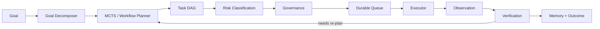

### 40.6 Durable scheduling

Schedules should survive process restarts.

```text
schedule
  ├── once
  ├── interval
  ├── cron-like recurrence
  └── condition-triggered
```

Durability requirements:

- persisted next-run time
- lease/lock to avoid duplicate execution
- idempotency key
- missed-run policy
- retry policy
- dead-letter state
- cancellation
- execution history
- clock/timezone normalization

---

## 41. Executive Briefing Engine

The v33 Morning Brief becomes a real evidence aggregator rather than a persona-specific hard-coded response.

### 41.1 Inputs

```text
Briefing Engine
 ├── Goals / Tasks / Runs
 ├── Overnight activity
 ├── Pending approvals
 ├── Failed / blocked work
 ├── Calendar
 ├── Email / inbox
 ├── GitHub
 ├── Deployment state
 ├── Alerts / observability
 ├── Memory / project priorities
 └── Operator preferences
```

### 41.2 Brief schema

```json
{
  "brief_id": "brief_01J...",
  "generated_at": "2026-09-01T00:30:00Z",
  "coverage": {
    "from": "2026-09-01T17:00:00Z",
    "to": "2026-09-01T00:30:00Z"
  },
  "completed": [],
  "failed": [],
  "blocked": [],
  "pending_approvals": [],
  "today": [],
  "important_messages": [],
  "repository_changes": [],
  "system_alerts": [],
  "priorities": [],
  "risks": [],
  "source_freshness": {},
  "missing_sources": []
}
```

### 41.3 Briefing rules

1. Do not invent a missing source.
2. Mark unavailable connectors.
3. Include freshness for time-sensitive claims.
4. Prefer verified completion evidence over model interpretation.
5. Separate:
   - confirmed facts
   - inferred priorities
   - recommendations
6. Link every operational claim to its evidence object or source record.
7. Redact secrets and sensitive payloads.

### 41.4 Delivery surfaces

```text
/api/v2/brief
Cockpit Brief panel
Voice summary
CLI
Scheduled delivery
Webhook / notification adapter
```

---

## 42. Memory Router & Context Budget

v33 retains ZASI's persistent and hypergraph memory capabilities, but adds a **Memory Router** so the model receives only context relevant to the current goal.

### 42.1 Memory classes

```text
Core Memory
  stable operator/project facts required frequently

Working Memory
  current run, current task, current plan

Conversation Memory
  dialogue turns and resolved references

Episodic Memory
  historical actions, outcomes and incidents

Semantic Memory
  retrieved knowledge / embeddings / documents

Project Memory
  repository, project, milestones and decisions

Tool Memory
  tool capabilities, past tool outcomes and learned constraints

Audit Memory
  immutable evidence and governance events
```

### 42.2 Retrieval pipeline

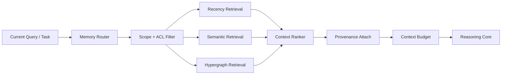

### 42.3 Retrieval score

A candidate memory may be ranked using:

```text
score =
    semantic_relevance
  × access_scope
  × freshness
  × source_reliability
  × project_match
  × task_match
  × non-duplication_factor
```

### 42.4 Memory provenance

```json
{
  "memory_id": "mem_01J...",
  "type": "project",
  "content_ref": "artifact://...",
  "source": "github.commit",
  "created_at": "...",
  "last_verified_at": "...",
  "trust": "verified_external",
  "project_id": "project_zasi",
  "access_scope": ["operator"],
  "retention": "project_lifetime"
}
```

### 42.5 Memory safety

- retrieved web text is untrusted content
- tool output is validated before long-term persistence
- secrets are not embedded into semantic indexes
- stale memories may be invalidated
- user corrections supersede inferred memories
- memory writes are auditable
- project boundaries are enforced

---

## 43. MCP Tool Fabric & Connectors

The existing MCP capability becomes the central **Tool Fabric** for v33.

### 43.1 Tool domains

```text
tool.fabric
├── github.*
├── git.*
├── email.*
├── calendar.*
├── files.*
├── web.*
├── browser.*
├── shell.*
├── docker.*
├── kubernetes.*
├── database.*
├── notification.*
├── media.*
├── maps.*
├── cad.*
└── custom.*
```

These are architectural namespaces; availability depends on installed and authorized connectors.

### 43.2 Tool manifest

```json
{
  "name": "github.create_pull_request",
  "version": "1",
  "risk_tier": "R3",
  "side_effect": true,
  "idempotent": false,
  "requires_auth": true,
  "approval": "explicit_or_scoped",
  "timeout_seconds": 30,
  "input_schema": {},
  "output_schema": {},
  "allowed_resources": ["repo:cvsz/zasi"]
}
```

### 43.3 Tool execution contract

```text
Planner
  ↓
Tool Proposal
  ↓
Schema Validation
  ↓
Capability Check
  ↓
Authentication Scope Check
  ↓
Risk Classification
  ↓
Approval Gate
  ↓
Sandbox / Connector
  ↓
Structured Result
  ↓
Verification
  ↓
Evidence Record
  ↓
Memory / Audit
```

### 43.4 Connector health

Every connector exposes:

```text
configured
authenticated
reachable
rate_limited
degraded
last_success_at
last_error
capabilities
```

---

## 44. APEX-Inspired ZASI Cockpit v33

The v33 cockpit adopts the interaction qualities of an autonomous-agent orb/reasoning interface while keeping **ZASI names, assets and branding**.

### 44.1 Frontend target

```text
Vite
React 19
TypeScript
React Router
three
@react-three/fiber
@react-three/postprocessing
WebSocket
SSE
Electron compatibility
```

#### Reference-aligned shell contract

The recordings establish a **desktop-first operational shell** around the orb. The shell is a workspace over the same runtime, not a collection of unrelated demos:

```text
┌──────────────────────────────────────────────────────────────────────────────┐
│ ZASI identity │ Observe │ Assist │ Do This │ Advanced │ Mobile Link │ clock  │
├───────────────┬───────────────────────────────────────┬──────────────────────┤
│ navigation    │                                       │ COMMAND STREAM        │
│ status        │             ZASI ORB / GRAPH          │ ordered events        │
│ goals         │       state, agents, plan, evidence   │ tool results          │
│ workspaces    │                                       │ approvals             │
│               │   transcript / command composer       │ SEQUENCE BUILDER      │
│               │   telemetry / freshness / source      │ draft → dry-run → run│
├───────────────┴───────────────────────────────────────┴──────────────────────┤
│ transport state │ CPU/RAM/NET │ session │ current run │ voice / push-to-talk │
└──────────────────────────────────────────────────────────────────────────────┘
```

The layout is responsive: the right rail becomes a drawer on narrow screens, the command composer remains keyboard- and touch-accessible, and no critical approval or error state is conveyed by color alone.

| Mode | Default authority | Required behavior |
|---|---|---|
| `Observe` | Read-only | Show status, telemetry, graph, evidence freshness, and activity without proposing side effects. |
| `Assist` | Read-only plus draft creation | Summarize, retrieve context, draft plans, and explain options; no external write. |
| `Do This` | Explicit bounded execution | Turn a confirmed request into a typed plan, show risk and affected resources, then execute only after policy checks. |
| `Advanced` | Privileged operator diagnostics | Expose traces, connector controls, and recovery actions with separate authentication and stronger confirmation. |
| `Engineering` | Artifact analysis | Ingest and inspect CAD/visual artifacts; physical actuation and manufacturing claims remain disabled by default. |
| `Humanoid` | Visual/telemetry view | Show humanoid models, animation, sensor state, and conversation context; it is not a robot-control grant. |
| `Mobile Link` | Pairing/session management | Pair, inspect, revoke, and monitor a mobile session; it never exposes a reusable API secret in a QR code. |

Persona choice changes voice, wording, and presentation. It must never change the mode’s authority, risk tier, approval requirement, or resource scope.

### 44.2 Target component layout

```text
web/
└── src/
    ├── app/
    │   ├── App.tsx
    │   ├── router.tsx
    │   └── providers.tsx
    ├── core/
    │   ├── ZasiOrb.tsx
    │   ├── ZasiCore3D.tsx
    │   ├── ReasoningGraph.tsx
    │   ├── AgentConstellation.tsx
    │   └── RuntimeStateRing.tsx
    ├── chief/
    │   ├── ExecutiveBrief.tsx
    │   ├── GoalBoard.tsx
    │   ├── TaskBoard.tsx
    │   ├── RunInspector.tsx
    │   ├── ApprovalQueue.tsx
    │   └── ActivityStream.tsx
    ├── memory/
    │   ├── MemoryExplorer.tsx
    │   ├── ContextInspector.tsx
    │   └── ProvenancePanel.tsx
    ├── tools/
    │   ├── ToolRegistry.tsx
    │   ├── ToolCallTrace.tsx
    │   └── ConnectorHealth.tsx
    ├── engineering/
    │   ├── CadViewer.tsx
    │   └── VisualAnalysis.tsx
    ├── observability/
    │   ├── Telemetry.tsx
    │   ├── Logs.tsx
    │   └── Traces.tsx
    └── api/
        ├── client.ts
        ├── websocket.ts
        ├── sse.ts
        └── types.ts
```

### 44.3 Orb runtime semantics

The orb is not merely decorative. It should map to real runtime state:

| Runtime State | Visual Meaning |
|---|---|
| IDLE | low-energy stable core |
| LISTENING | input waveform |
| UNDERSTANDING | context pulse |
| PLANNING | expanding reasoning graph |
| POLICY_CHECK | bounded verification ring |
| WAITING_APPROVAL | amber approval state |
| EXECUTING | active tool-node animation |
| VERIFYING | convergence / validation pulse |
| REPORTING | speech / response waveform |
| FAILED | explicit error state, not fake success |

### 44.4 Cockpit routes v33

```text
/                    Command center
/brief               Executive brief
/goals               Goals and outcomes
/tasks               Task board
/runs                Execution runs
/jarvis              Conversation / voice
/reasoning            Plan and reasoning trace
/approvals            Approval queue
/activity             Tool/action timeline
/memory               Memory explorer
/tools                MCP tool registry
/connectors           Connector health
/engineering/cad      CAD viewer
/engineering/vision   Visual analysis
/subsystems           Capability registry
/governance           Policy / invariants / audit
/telemetry            Metrics / traces / logs
/settings             Runtime settings
```

### 44.5 UX safety rule

The cockpit must visually distinguish:

```text
REAL
SIMULATED
ESTIMATED
DEGRADED
UNAVAILABLE
PENDING_APPROVAL
FAILED
```

It must never make simulated success visually indistinguishable from verified execution success.

### 44.6 Command stream and sequence builder

The reference command stream is the operator’s explanation surface. It is backed by the same append-only event model used by the API and must show at least:

```text
timestamp · source · state · action/tool · resource · result · evidence · next step
```

The sequence builder is a workflow authoring surface, not a text-to-shell shortcut. A saved sequence contains typed steps:

```json
{
  "sequence_id": "seq_01J...",
  "name": "Morning operations check",
  "mode": "assist",
  "steps": [
    {
      "step_id": "step_1",
      "intent": "brief.generate",
      "arguments": {"window": "overnight"},
      "depends_on": [],
      "risk_tier": "R0",
      "approval": "none",
      "timeout_seconds": 60,
      "retry": {"max_attempts": 2},
      "verify": "brief.sources_present"
    }
  ],
  "status": "draft"
}
```

Required lifecycle:

```text
DRAFT → VALIDATED → DRY_RUN → WAITING_APPROVAL → RUNNING → VERIFYING → COMPLETE
                         └──────────────→ DENIED / CANCELLED / FAILED / PARTIAL
```

Every step is re-authorized at execution time. A sequence cannot smuggle a newly added tool, resource, or argument through a previously approved draft. Save, start, pause, resume, cancel, retry, and delete operations are audited; deletion is a metadata action and never erases run history.

### 44.7 Mobile Link and pairing

The QR flow shown in the reference is implemented as a one-time pairing ceremony:

1. The desktop creates a short-lived pairing record bound to the operator, host session, origin, and requested capabilities.
2. The QR encodes only a one-time token or opaque pairing URL; it never contains `ZASI_API_KEY`, a bearer token, or an unbounded LAN credential.
3. The mobile client authenticates, displays requested permissions, and receives a scoped device/session credential.
4. Both sides show paired identity, last heartbeat, transport state, expiry, and revoke controls.
5. Reconnect requires token rotation or a still-valid session; revocation invalidates outstanding credentials.

LAN addresses, loopback URLs, or tunnel URLs are display metadata, not proof of reachability. The pairing UI must report `UNREACHABLE`, `UNAUTHENTICATED`, or `STALE` distinctly from `CONNECTED`.

### 44.8 Engineering and humanoid workspace composition

The engineering surface follows the multi-panel pattern from the recordings:

```text
left: goals / capabilities / input artifact
center: CAD viewport, mesh, grid, or visual analysis canvas
right: J.A.R.V.I.S. explanation, command stream, evidence, downloads
bottom: parser state, units, artifact hash, analysis status, errors
```

The humanoid surface may reuse the same orb, avatar, transcript, and state ring, but it must disclose whether a frame is a recording, a rendered model, a live sensor feed, or a simulator. “Head”, “finger”, gesture, or motion language does not grant a physical actuator path.

---

## 45. Real CAD / Engineering Pipeline

The v33 CAD feature must ingest actual files rather than return only hard-coded engineering metadata.

### 45.1 Supported target inputs

```text
STEP
IGES
STL
OBJ
GLTF / GLB
```

### 45.2 Pipeline

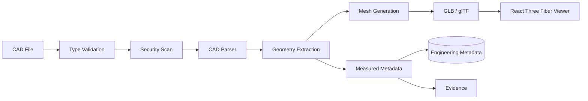

### 45.3 Candidate local libraries

Implementation may use suitable open-source components such as:

- OpenCascade / pythonOCC for STEP/IGES
- trimesh for mesh operations
- meshio for mesh conversion
- pygltflib or equivalent for glTF metadata

Library selection must be validated against supported Python versions and deployment profiles.

### 45.4 Engineering truth rules

The CAD service may report directly measured geometry:

- bounding box
- face / edge / vertex counts
- mesh triangle count
- enclosed volume when calculable
- center of mass only when assumptions are known
- unit system

It must not claim:

- FEA stress safety
- thermal safety
- material correctness
- manufacturing tolerance compliance
- mass

unless the necessary material, units, solver and boundary conditions are explicitly supplied and the analysis actually ran.

### 45.5 CAD evidence

```json
{
  "artifact_id": "cad_01J...",
  "source_file_hash": "sha256:...",
  "format": "STEP",
  "units": "mm",
  "bbox": {"x": 120.0, "y": 85.0, "z": 45.0},
  "volume_mm3": 421234.5,
  "parser": "opencascade",
  "measured_at": "...",
  "analysis": {
    "fea": "not_run",
    "thermal": "not_run"
  }
}
```

### 45.6 Engineering workspace contract

The engineering workspace shown in the reference recordings exposes a prompt, a generated model, a 3D viewer, and download actions. ZASI maps those affordances to explicit artifact states:

```text
UPLOADED
  ↓ hash + type + size validation
QUARANTINED
  ↓ parser sandbox
PARSING
  ↓ measured geometry
MEASURED
  ↓ optional mesh conversion
VIEWABLE
  ↓ optional solver invocation with supplied inputs
ANALYSIS_COMPLETE | ANALYSIS_NOT_RUN | ANALYSIS_FAILED
```

`Download STL` and `Download STEP` are enabled only when a corresponding artifact was actually generated, hashed, stored, and linked to the run. A text response that says “STL ready” is not sufficient. Generated artifacts carry:

- source artifact hash and parent run
- format, units, coordinate system, and conversion tool/version
- output hash and byte size
- generation status and timestamp
- limitations and unsupported analyses

The viewer is a read-only artifact consumer unless a separately authorized edit/export action is proposed. Geometry inspection and engineering safety certification are different capabilities and must remain different UI and policy paths.

---

## 46. Visual Intelligence & Competitor Analysis

v33 visual analysis becomes a real multimodal pipeline.

### 46.1 Inputs

```text
Screenshot
Image
PDF page
Web capture
UI recording frame
```

### 46.2 Pipeline

```text
Ingest
  ↓
Trust / source labeling
  ↓
Image normalization
  ↓
Vision model / detector
  ↓
Layout segmentation
  ↓
Component extraction
  ↓
Design token inference
  ↓
Feature extraction
  ↓
Comparison against ZASI
  ↓
Gap / recommendation report
  ↓
Evidence + artifact storage
```

### 46.3 Output

```json
{
  "analysis_id": "vision_01J...",
  "source_hash": "sha256:...",
  "detected_regions": [],
  "components": [],
  "design_tokens": {},
  "features": [],
  "confidence": {},
  "comparison": {
    "present_in_reference": [],
    "present_in_zasi": [],
    "gaps": [],
    "recommendations": []
  }
}
```

### 46.4 Rule

Fallback demo strings must not be returned as if they were detections from the supplied screenshot.

### 46.5 Reference comparison boundary

Competitor or reference analysis may describe visible interaction patterns—mode rails, graph/orb composition, command timelines, sequence authoring, CAD affordances, or humanoid presentation—and compare them with observed ZASI surfaces. It must not infer private implementation, security, business performance, or capability from appearance alone. Every comparison report distinguishes:

```text
observed in supplied media
observed in current ZASI source
implemented and runtime-verified
recommended product gap
```

The source media is untrusted input to the analysis pipeline. It may influence design recommendations, but it cannot authorize tool use, alter policy, or become a trusted memory without provenance and operator review.

---

## 47. Voice Runtime v33

v33 upgrades from browser-only speech helpers or simulated voice packets to a layered production voice architecture.

### 47.1 Pipeline

```text
Microphone
  ↓
Noise Suppression
  ↓
AEC
  ↓
VAD
  ↓
Wake Word / Push-to-Talk
  ↓
Streaming STT
  ↓
Language Detection
  ↓
Intent / Dialogue
  ↓
Response
  ↓
Streaming TTS
```

### 47.2 Local-first target

| Capability | Preferred Local Option | Fallback |
|---|---|---|
| Wake word | openWakeWord | push-to-talk |
| VAD | Silero VAD | WebRTC VAD |
| STT | whisper.cpp | authorized remote STT |
| TTS | Piper | platform TTS / authorized remote TTS |

### 47.3 Thai and multilingual behavior

The system should preserve the detected language unless:

- user preference specifies another language
- task requires source-language quoting
- a connector returns localized content
- the user explicitly requests translation

### 47.4 Optional speaker verification

Speaker verification is an **authentication signal**, not unrestricted authorization.

Pipeline:

```text
Audio
  ↓
Quality / anti-replay checks
  ↓
Speaker embedding
  ↓
Similarity scoring
  ↓
Authentication confidence
  ↓
Policy engine
```

For R3+ actions, voice similarity alone must not bypass required approval policies.

Biometric data requires:

- explicit opt-in
- encrypted storage
- revocation
- retention controls
- no raw voiceprint logging
- clear fallback authentication

### 47.5 Reference-aligned voice state contract

The listening/speaking visuals in the recordings map to explicit transport and dialogue states:

```text
IDLE
  → LISTENING
  → SPEECH_DETECTED
  → TRANSCRIBING
  → UNDERSTANDING
  → PLANNING / WAITING_APPROVAL / EXECUTING
  → RESPONDING
  → SPEAKING
  → IDLE
```

The UI may show waveform, orb energy, transcript, and “system clear” language only from state events. `SYSTEM_CLEAR` is a derived result requiring the configured health/policy checks to have completed; it is not a decorative success animation. Microphone-off, permission-denied, no-speech, transcription failure, cloud fallback, and stale audio states are visible and interruptible.

The current browser `SpeechRecognition` / `speechSynthesis` path is a convenience adapter. The production contract requires an explicit audio session, input-device permission, language, transcript confidence, provider/locality, cancellation, retention policy, and correlation ID. A recognized voice command still becomes an intent and follows the same mode, policy, approval, execution, verification, and evidence path as typed input.

---

## 48. v33 Persistence Model

The v32 persistence model expands to represent durable autonomous work.

### 48.1 Core tables / collections

```text
users
profiles
projects
sessions
messages
entities
preferences

goals
goal_success_criteria
tasks
task_dependencies
schedules
runs
actions
tool_calls
observations
verifications
artifacts

approvals
approval_scopes
policies
capability_grants
audit_events
evidence_records

memories
memory_links
memory_provenance

briefs
brief_sources

subsystems
subsystem_health
connectors
connector_health

webhooks
mcp_clients
mcp_tool_calls
```

### 48.2 Local and server profiles

```text
Personal/local:
SQLite + local vector index

Server:
PostgreSQL + Redis + optional vector extension/service

Distributed:
PostgreSQL
Redis or durable queue
object/artifact store
worker fleet
```

### 48.3 Event sourcing boundary

High-value state transitions should also emit immutable events:

```text
goal.created
task.queued
run.started
action.proposed
approval.requested
approval.granted
tool.started
tool.completed
verification.passed
verification.failed
run.completed
brief.generated
```

---

## 49. v33 Governance & Authorization

The governance plane becomes the mandatory gateway for all side effects.

### 49.1 Authorization dimensions

```text
WHO        actor / identity
WHAT       requested operation
WHERE      resource scope
WHEN       time / session / expiry
WHY        goal and plan context
RISK       R0-R5
EVIDENCE   supporting context
POLICY     applicable policy version
```

### 49.2 Capability grants

```json
{
  "grant_id": "grant_01J...",
  "subject": "agent:jarvis",
  "capability": "github.pull_request.create",
  "resource": "repo:cvsz/zasi",
  "expires_at": "2026-09-01T03:00:00Z",
  "max_uses": 3,
  "approval_id": "apr_01J..."
}
```

### 49.3 Approval scopes

```text
approve once
approve exact action
approve exact resource for session
approve bounded action class for time window
deny
edit arguments
cancel goal
```

### 49.4 Security invariants

```text
∀ tool_call:
  schema_valid(tool_call)

∀ side_effect:
  authorized(side_effect)

∀ secret:
  not_logged(secret)

∀ external_write:
  resource ∈ granted_scope

∀ R4_action:
  explicit_confirmation = true

∀ evidence_claim:
  evidence_id exists OR claim is labeled inferred/simulated

∀ connector:
  credentials are scoped to connector

∀ retry:
  no duplicate side effect without idempotency protection
```

---

## 50. API v2 — Chief-of-Staff Control Plane

Existing `/api/*` endpoints may remain for compatibility. New durable orchestration should use versioned v2 endpoints.

### 50.1 Goal and task APIs

```text
POST   /api/v2/goals
GET    /api/v2/goals
GET    /api/v2/goals/{goal_id}
PATCH  /api/v2/goals/{goal_id}
POST   /api/v2/goals/{goal_id}/cancel

POST   /api/v2/tasks
GET    /api/v2/tasks
GET    /api/v2/tasks/{task_id}
POST   /api/v2/tasks/{task_id}/retry
POST   /api/v2/tasks/{task_id}/cancel
```

### 50.2 Run APIs

```text
POST   /api/v2/runs
GET    /api/v2/runs
GET    /api/v2/runs/{run_id}
GET    /api/v2/runs/{run_id}/events
POST   /api/v2/runs/{run_id}/cancel
```

### 50.3 Approval APIs

```text
GET    /api/v2/approvals
GET    /api/v2/approvals/{approval_id}
POST   /api/v2/approvals/{approval_id}/approve
POST   /api/v2/approvals/{approval_id}/deny
POST   /api/v2/approvals/{approval_id}/edit
```

### 50.4 Brief APIs

```text
POST   /api/v2/briefs
GET    /api/v2/briefs/latest
GET    /api/v2/briefs/{brief_id}
```

### 50.5 Memory APIs

```text
POST   /api/v2/memory/search
GET    /api/v2/memory/{memory_id}
POST   /api/v2/memory/{memory_id}/invalidate
```

### 50.6 Tool and connector APIs

```text
GET    /api/v2/tools
GET    /api/v2/tools/{tool_name}
POST   /api/v2/tools/{tool_name}/invoke

GET    /api/v2/connectors
GET    /api/v2/connectors/{connector_id}/health
```

### 50.7 Engineering APIs

```text
POST   /api/v2/cad/ingest
GET    /api/v2/cad/{artifact_id}
GET    /api/v2/cad/{artifact_id}/mesh

POST   /api/v2/vision/analyze
GET    /api/v2/vision/{analysis_id}
```

### 50.8 Streaming

```text
/ws/v2/events
/api/v2/runs/{run_id}/stream
/api/v2/jarvis/stream
```

### 50.9 Experience, sequence, device, and capability APIs

These resources support the reference-aligned shell without giving the UI a second execution path:

```text
POST   /api/v2/sessions
GET    /api/v2/sessions/{session_id}
POST   /api/v2/sessions/{session_id}/close
POST   /api/v2/intents
GET    /api/v2/capabilities
GET    /api/v2/capabilities/{capability_id}

POST   /api/v2/sequences
GET    /api/v2/sequences
GET    /api/v2/sequences/{sequence_id}
PATCH  /api/v2/sequences/{sequence_id}
POST   /api/v2/sequences/{sequence_id}/validate
POST   /api/v2/sequences/{sequence_id}/dry-run
POST   /api/v2/sequences/{sequence_id}/start
POST   /api/v2/sequences/{sequence_id}/cancel
DELETE /api/v2/sequences/{sequence_id}

POST   /api/v2/devices/pairings
GET    /api/v2/devices/pairings
POST   /api/v2/devices/pairings/{pairing_id}/revoke
GET    /api/v2/devices/{device_id}/health

GET    /api/v2/events?session_id={id}&after={cursor}
GET    /api/v2/runs/{run_id}/artifacts
GET    /api/v2/artifacts/{artifact_id}
```

The UI uses `POST /api/v2/intents` for typed user requests and receives a plan or an approval request. It never calls an executor directly. `DELETE /sequences/{id}` removes a draft or hides a saved definition according to retention policy; it never deletes immutable execution, approval, or evidence records.

---

## 51. v33 Observability, SLOs & Cost Telemetry

v33 observability must cover autonomous work rather than only host metrics.

### 51.1 New metrics

```text
zasi_goal_active
zasi_task_queue_depth
zasi_task_duration_seconds
zasi_run_success_total
zasi_run_failure_total
zasi_run_retry_total

zasi_tool_call_total
zasi_tool_call_duration_seconds
zasi_tool_error_total

zasi_approval_pending
zasi_approval_latency_seconds
zasi_policy_denial_total

zasi_memory_retrieval_duration_seconds
zasi_context_tokens
zasi_context_sources

zasi_brief_source_freshness_seconds
zasi_evidence_missing_total

zasi_connector_health
zasi_connector_error_total
```

### 51.2 Suggested initial SLOs

These are targets and must be tuned from measured production data:

| Surface | Initial Target |
|---|---|
| API availability | ≥ 99.9% |
| `/api/status` p95 | < 250 ms |
| local policy decision p95 | < 100 ms |
| approval event delivery p95 | < 1 s |
| WebSocket event propagation p95 | < 1 s |
| durable task loss | 0 accepted |
| duplicate externally-visible side effect | 0 accepted |
| secret leakage in logs | 0 accepted |
| fabricated operational success claim | 0 accepted |

### 51.3 Cost telemetry

For external models and APIs track:

```text
provider
model
input_tokens
output_tokens
request_count
estimated_cost
latency
cache_hit
fallback_used
```

Cost policy may route low-risk work to local/free providers and reserve premium external models for tasks that justify them.

---

## 52. Repository Layout Target — v33

```text
zasi/
├── apps/
│   ├── api/
│   ├── cockpit/
│   └── edge/
│
├── zasi/
│   ├── core/
│   │   ├── reasoning/
│   │   ├── planning/
│   │   ├── goals/
│   │   ├── tasks/
│   │   ├── runs/
│   │   ├── scheduling/
│   │   ├── personas/
│   │   └── schemas/
│   │
│   ├── memory/
│   │   ├── router.py
│   │   ├── working.py
│   │   ├── episodic.py
│   │   ├── semantic.py
│   │   ├── project.py
│   │   └── provenance.py
│   │
│   ├── governance/
│   │   ├── policy.py
│   │   ├── risk.py
│   │   ├── approvals.py
│   │   ├── capabilities.py
│   │   └── evidence.py
│   │
│   ├── execution/
│   │   ├── broker.py
│   │   ├── sandbox/
│   │   ├── tool_registry.py
│   │   └── verification.py
│   │
│   ├── protocols/
│   │   └── mcp/
│   │
│   ├── integrations/
│   │   ├── github/
│   │   ├── email/
│   │   ├── calendar/
│   │   ├── files/
│   │   ├── web/
│   │   ├── docker/
│   │   └── kubernetes/
│   │
│   ├── engineering/
│   │   ├── cad/
│   │   └── vision/
│   │
│   ├── briefing/
│   ├── models/
│   ├── observability/
│   └── subsystem_registry/
│
├── research/
│   ├── simulations/
│   └── experimental/
│
├── tests/
│   ├── unit/
│   ├── integration/
│   ├── contract/
│   ├── security/
│   └── e2e/
│
├── deploy/
│   ├── docker/
│   ├── compose/
│   └── kubernetes/
│
└── docs/
    ├── FULL_ARCHITECTURE.md
    ├── CHIEF_OF_STAFF.md
    ├── SECURITY_ARCHITECTURE.md
    ├── TOOL_FABRIC.md
    ├── MEMORY.md
    ├── CAD.md
    ├── EVIDENCE.md
    └── OPERATIONS.md
```

---

## 53. Migration Plan — v32 → v33

### Phase 0 — Truth & safety normalization

- inventory all hard-coded operational claims
- classify each as measured / derived / reported / simulated / estimated
- add evidence model
- prevent simulator output from being presented as production telemetry
- add runtime maturity status to subsystem registry

**Exit criteria:**

```text
[ ] no fabricated production-success claims
[ ] all displayed subsystem states carry maturity/runtime status
[ ] evidence object available to API and cockpit
```

### Recommended first production vertical slice

Before adding autonomous writes, build one narrow path end to end:

```text
authenticated operator session
  → Observe / Assist mode
  → measured status + telemetry snapshot
  → typed `brief.generate` intent
  → evidence-backed brief
  → ordered command-stream events
  → reconnect from cursor or authoritative resync
```

This slice should use the reference-aligned shell—orb state, left navigation, command stream, source/freshness badges, and the command composer—but keep `Do This`, CAD export, humanoid actuation, and external writes disabled. It proves the core contract that every later workspace depends on: identity, session scope, typed events, truthful display, and recovery after disconnect.

Acceptance evidence for the slice:

```text
[ ] unauthenticated session cannot subscribe to events
[ ] event order survives reconnect and cursor replay
[ ] missing telemetry/source is shown as unavailable, never invented
[ ] every brief claim links to a source/evidence record
[ ] the orb state is driven by server events, not a timer alone
[ ] UI and API expose the same run/session status
```

### Phase 1 — Core orchestration

- implement Goal
- implement Task
- implement Run
- implement Action / Observation / Verification
- correlation IDs
- idempotency keys
- retry and cancellation
- durable schedules

**Exit criteria:**

```text
[ ] restart does not lose queued work
[ ] duplicate side effects prevented
[ ] task history reconstructable from events
```

### Phase 2 — Governance & approval

- capability manifests
- risk classifier
- approval service
- scoped grants
- approval Cockpit route
- immutable audit events

**Exit criteria:**

```text
[ ] R3+ writes cannot execute without authorization
[ ] approval scope enforced at tool-call time
[ ] denials and grants visible in audit trail
```

### Phase 3 — Memory router

- memory type contracts
- project scope
- provenance
- stale-memory invalidation
- retrieval budget
- context inspector UI

**Exit criteria:**

```text
[ ] context source provenance visible
[ ] cross-project leakage test passes
[ ] stale-memory invalidation test passes
```

### Phase 4 — Cockpit modernization

- upgrade frontend dependencies to React 19 and React Router 7
- add a strict TypeScript root entrypoint and typecheck
- convert the preserved application body to TypeScript incrementally
- remove global React / Router / THREE assumptions
- adopt module dependencies
- add ZasiOrb
- add ReasoningGraph
- add Goal/Task/Run views
- add ApprovalQueue
- add ActivityStream
- add Evidence badges

**Exit criteria:**

```text
[ ] production build passes
[ ] accessibility tests pass
[ ] reduced-motion supported
[ ] runtime state accurately drives animation
```

### Phase 5 — Executive briefing & productivity connectors

- evidence-grounded brief engine
- GitHub connector
- email connector
- calendar connector
- files connector
- connector health model
- scheduled daily brief

**Exit criteria:**

```text
[ ] missing connector never produces invented data
[ ] every brief claim has source provenance
[ ] pending approvals / failures surface in brief
```

### Phase 6 — Engineering intelligence

- real CAD ingestion
- mesh viewer
- measured geometry metadata
- real screenshot analysis
- visual comparison reports
- engineering artifacts and evidence

**Exit criteria:**

```text
[ ] STEP smoke-test file parses
[ ] mesh renders in browser
[ ] unsupported simulation claims are labeled not_run
[ ] visual analysis reflects actual supplied image
```

### Phase 7 — Voice runtime

- local STT
- local TTS
- streaming audio
- Thai/multilingual handling
- optional speaker verification
- privacy controls

**Exit criteria:**

```text
[ ] end-to-end voice task completes
[ ] voice auth cannot bypass R3+ approval
[ ] local-only profile works without cloud model
```

### Phase 8 — Distributed production readiness

- PostgreSQL migration
- Redis / durable queue
- worker leases
- dead-letter flow
- OpenTelemetry
- HA deployment
- backups
- restore tests
- SBOM
- signing
- release evidence

**Exit criteria:**

```text
[ ] staging restore test passes
[ ] worker crash does not lose task
[ ] rollout / rollback verified
[ ] release evidence bundle generated
```

---

## 54. v33 Test Matrix

| Area | Required Tests |
|---|---|
| Goal orchestration | DAG creation, cancellation, dependency handling |
| Durability | restart recovery, lease expiry, duplicate suppression |
| Tool Fabric | schema validation, auth scope, timeout, retry |
| Approval | approve once, session scope, deny, expiry |
| Evidence | freshness, missing evidence, simulation labeling |
| Memory | provenance, ACL, stale invalidation, project isolation |
| Briefing | source failure, stale source, conflicting sources |
| CAD | format validation, malformed file, unit handling, mesh output |
| Vision | screenshot ingest, real extraction, unsupported input |
| Voice | VAD/STT/TTS flow, language switch, auth boundary |
| Security | SSRF, path traversal, command injection, prompt injection |
| Cockpit | state transitions, accessibility, reduced motion, mode authority |
| Reference shell | command stream ordering, orb truth states, sequence dry-run/start, evidence badges |
| Mobile Link | one-time QR, permission display, reconnect, revoke, unreachable/stale state |
| Engineering | CAD artifact hash, parser status, measured geometry, download gating |
| Humanoid | recording/render/live/simulator disclosure, no implicit actuator authority |
| Distributed | queue recovery, idempotency, backpressure |
| API | OpenAPI contract, versioning, auth, rate limits |

---

## 55. v33 Architectural Definition of Done

A v33 feature is production-ready only when all applicable items are satisfied. These are acceptance gates, not claims that the current repository already satisfies them:

```text
[ ] real implementation exists
[ ] implementation status is accurately labeled
[ ] typed interface/schema exists
[ ] capability manifest exists
[ ] risk tier assigned
[ ] authorization path defined
[ ] approval path tested when applicable
[ ] idempotency behavior defined
[ ] retry behavior defined
[ ] rollback / compensation behavior defined
[ ] unit tests pass
[ ] integration tests pass
[ ] security tests pass
[ ] failure paths tested
[ ] observability emitted
[ ] evidence / provenance emitted
[ ] documentation matches runtime behavior
[ ] UI distinguishes real / simulated / degraded / unavailable
[ ] no fabricated success claims
[ ] secrets are not logged
[ ] production readiness reviewed
```

---

## 56. Final v33 Reference Architecture

```text
┌──────────────────────────────────────────────────────────────────────────────┐
│                           EXPERIENCE / COCKPIT                               │
│ Voice • Web • Electron • Mobile • CLI • MCP • ZASI Orb • Reasoning Graph   │
└───────────────────────────────────┬──────────────────────────────────────────┘
                                    │
┌───────────────────────────────────▼──────────────────────────────────────────┐
│                        PERCEPTION / LANGUAGE                                 │
│ Wake • VAD • AEC • STT • Vision • Intent • NLU • Entity / Slot Resolution │
└───────────────────────────────────┬──────────────────────────────────────────┘
                                    │
┌───────────────────────────────────▼──────────────────────────────────────────┐
│                       CHIEF-OF-STAFF ORCHESTRATION                           │
│ Goals • Tasks • Runs • Schedules • Dependencies • Priorities • Outcomes    │
└─────────────────┬─────────────────┬──────────────────┬───────────────────────┘
                  │                 │                  │
          ┌───────▼───────┐ ┌──────▼────────┐ ┌──────▼─────────────┐
          │ COGNITIVE CORE│ │ MEMORY ROUTER │ │ BRIEFING ENGINE   │
          │ Reasoner      │ │ Working       │ │ Activity          │
          │ MCTS Planner  │ │ Episodic      │ │ Calendar          │
          │ World Model   │ │ Semantic      │ │ Email / GitHub    │
          │ Re-planning   │ │ Project       │ │ Alerts / KPIs     │
          └───────┬───────┘ └──────┬────────┘ └──────┬─────────────┘
                  │                │                  │
                  └────────────────┼──────────────────┘
                                   │
┌──────────────────────────────────▼───────────────────────────────────────────┐
│                    GOVERNANCE / EVIDENCE / APPROVAL                          │
│ Auth • RBAC • Risk • SMT • Capability Grants • Human Approval • Evidence   │
│ Provenance • Policy Versioning • Audit Ledger • No-Fabrication Enforcement  │
└──────────────────────────────────┬───────────────────────────────────────────┘
                                   │
┌──────────────────────────────────▼───────────────────────────────────────────┐
│                         MCP TOOL FABRIC                                      │
│ GitHub • Email • Calendar • Files • Web • Browser • Shell • DB • Docker    │
│ Kubernetes • Media • Maps • CAD • Vision • Custom Scoped Connectors         │
└──────────────────────────────────┬───────────────────────────────────────────┘
                                   │
┌──────────────────────────────────▼───────────────────────────────────────────┐
│                         EXECUTION PLANE                                      │
│ Execution Broker • Sandbox • Durable Queue • Workers • Idempotency • Retry  │
│ Timeouts • Verification • Artifacts • Structured Results                    │
└──────────────────────────────────┬───────────────────────────────────────────┘
                                   │
┌──────────────────────────────────▼───────────────────────────────────────────┐
│                         DATA / PLATFORM                                      │
│ REST v1/v2 • WS • SSE • SQLite/Postgres • Redis • Vector • Object Storage  │
│ Event Stream • Connector State • Evidence Store • OpenTelemetry             │
└──────────────────────────────────┬───────────────────────────────────────────┘
                                   │
┌──────────────────────────────────▼───────────────────────────────────────────┐
│                         OPERATIONS / ASSURANCE                               │
│ CI/CD • Containers • Kubernetes • Security Scan • SBOM • Signing • Backup  │
│ Restore Tests • SLOs • Incident Response • Release Evidence                 │
└──────────────────────────────────────────────────────────────────────────────┘
```

### 56.1 Core v33 execution path

```text
User Goal
  ↓
Intent / Context
  ↓
Goal + Task Decomposition
  ↓
Planner
  ↓
Memory Retrieval
  ↓
Action Proposal
  ↓
Policy + Risk + SMT
  ↓
Approval if required
  ↓
Capability Grant
  ↓
Durable Tool Execution
  ↓
Structured Observation
  ↓
Verification
  ↓
Evidence Record
  ↓
Memory + Audit
  ↓
Outcome / Brief / Cockpit
```

---

## 57. v33 Final Summary

ZASI v33 should not be judged by the number of modeled subsystems. It should be judged by whether it can **reliably complete bounded real-world work with evidence, authorization, recoverability and human control**.

The v33 architecture therefore prioritizes:

1. **Truth before spectacle** — measured reality is distinct from simulation.
2. **Durability before autonomy claims** — tasks survive restarts and retries.
3. **Governance before side effects** — tools execute only with bounded authority.
4. **Evidence before completion claims** — success must be verifiable.
5. **Memory with provenance** — context is scoped, attributable and correctable.
6. **A real Chief-of-Staff workflow** — goals, tasks, approvals, schedules and briefs.
7. **A reference-aligned multi-surface cockpit** — mode rail, orb/graph, command stream, sequence builder, engineering, humanoid, and mobile workspaces share one runtime.
8. **A stateful operational cockpit** — the UI reflects actual runtime state.
9. **Incremental production maturity** — each capability advances from conceptual → simulator → adapter → real → production-ready only with evidence.

The intended outcome is a ZASI deployment that can move from:

```text
"Here is what the system could theoretically do."
```

to:

```text
"Here is what was requested,
what plan was approved,
what tools actually ran,
what evidence was produced,
what succeeded or failed,
what changed,
and what should happen next."
```

That is the architectural threshold for **ZASI v33 Autonomous Chief-of-Staff**.
