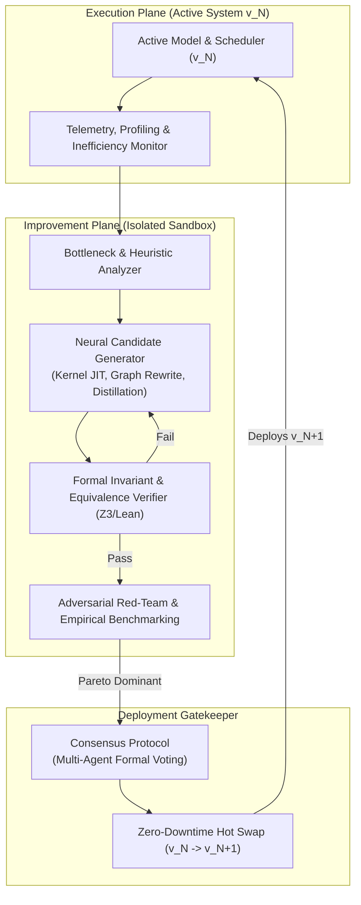
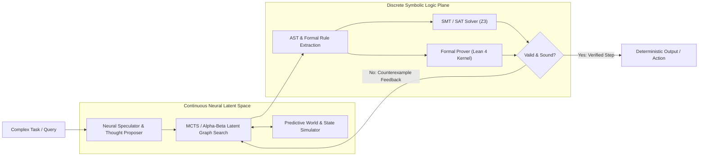
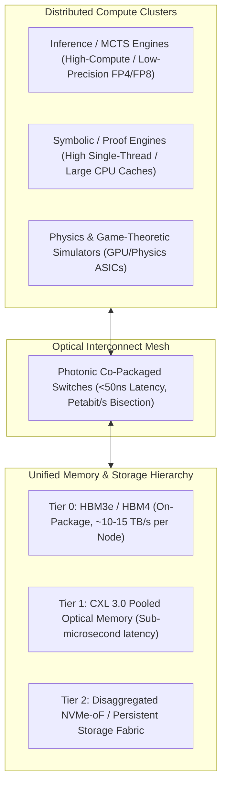

# Artificial Superintelligence (ASI): Full Technical System Blueprint

> **Status — 2026-09-02:** This document is a historical research/design
> blueprint. It is not an implementation certificate and does not establish
> ASI/AGI capability, formal proof, hyperscale infrastructure, physical
> hardware, recursive self-improvement, or safe deployment. The current
> reference profile is an authenticated, local SQLite, read-only/assistive
> control plane; dynamic code execution, runtime hot swap, physical actuation,
> and unverified proof claims remain disabled or unavailable. See
> [ZASI_IMPLEMENTATION_SPECIFICATION.md](ZASI_IMPLEMENTATION_SPECIFICATION.md)
> for the authoritative runtime contract.

This document specifies the technical architecture for an Artificial Superintelligence (ASI) system across three foundational pillars:
1. **Recursive Self-Improvement (RSI) Engine** (Safe meta-optimization loop)
2. **Neural-Symbolic Hybrid Reasoning Core** (Zero-hallucination formal proof & generative search)
3. **Hyperscale Distributed Compute & Memory Topology** (Physical and network infrastructure substrate)

---

## 1. Recursive Self-Improvement (RSI) Engine

The RSI subsystem enables the system to continuously refactor its own algorithms, model weights, execution kernels, and cognitive heuristics under strict formal verification.

### Key Components (target design, not current runtime):
- **Profile-Guided Architecture Synthesis**: Continuous low-level profiling detects latency bottlenecks, memory bandwidth saturation, and algorithmic inefficiencies across reasoning trees.
- **Formal Invariant Preservation**: Modifications to policy code or core neural execution paths must emit machine-checkable proofs (e.g., in Lean/Coq) demonstrating that safety boundaries, objective invariants, and mathematical correctness are maintained.
- **Atomic Hot Swapping**: Model components, tensor layouts, and Triton/CUDA/custom ASIC microkernels are updated live without stalling active inference streams.

---

## 2. Neural-Symbolic Hybrid Reasoning Core

Combines statistical intuition (dense neural representations and speculative generation) with strict logical deduction (formal theorem provers, SAT/SMT solvers, and causal hypergraphs).

### Key Mechanisms:
- **Neural Proposal, Symbolic Proof**: Neural networks propose search branches, lemma candidates, and program structures; symbolic engines evaluate, verify, or produce counterexamples.
- **Closed-Loop Counterexample Refinement**: Failed verification runs inject precise trace logs directly into the prompt/attention context of the neural generator, pruning entire invalid subtrees instantly.
- **Hypergraph Knowledge Store**: Entities, relations, and causal mechanisms are indexed as non-Euclidean graph structures coupled with high-dimensional vector embeddings, preventing semantic drift and hallucinations.

---

## 3. Hyperscale Distributed Compute & Memory Topology

The physical and logical infrastructure fabric required to sustain real-time world simulation, parallel tree search, and continuous fine-grained model updates.

### Architectural Specifications:
- **Heterogeneous Workload Allocation**:
  - **FP4/FP8 Tensor Arrays**: Execute high-throughput latent rollouts, predictive physics, and speculative generation.
  - **High-Clock Symbolic Accelerators**: Optimized for instruction branch prediction, recursion, and SAT/SMT graph traversal.
- **CXL 3.0 Optical Memory Pool**: Shared, cache-coherent global memory allowing millions of parallel search nodes to query and mutate the shared hypergraph without serial serialization bottlenecks.
- **Photonic Interconnect**: Direct optical switching between compute racks ensures near-zero latency overhead for collective operations during massive multi-agent consensus loops.

---

## 4. Historical verification and prototype notes

The original prototype notes below describe intended or historical experiments.
They are retained for traceability but are not current release evidence. A
passing local fixture, hash, arithmetic check, or model output does not prove a
formal theorem, safe RSI upgrade, atomic hot swap, or post-upgrade production
runtime:

1. **Architecture Blueprint**: Detailed in [asi_complete_architecture.md](asi_complete_architecture.md).
2. **Prototype Implementation**: Historical implementation references include `asi_prototype.py` and the `src/` modules; current production authority is `backend.app`.
3. **Execution Results**:
   - **Historical neural proposal + verification claim**: Candidate generation and rejection of an unsafe branch were exercised in a prototype fixture; this is not a current control-plane authorization or formal-proof result.
   - **Historical RSI claim**: Candidate `v1.1.0-jit-heuristic`, the $2.4\times$ Pareto result, and atomic hot-swap are retained as prototype notes only; the current reference profile rejects dynamic self-compilation and runtime hot swap.
   - **Historical post-upgrade claim**: Subsequent cognitive cycles were described for the prototype; no self-improved production engine is enabled by the current runtime.
